My plan was to capture the supermoon coming up over the horizon, with a tree in the foreground. I also wanted to produce a bracketed HDR version; which would show more dynamic range and details on the moon itself vs. just a bright yellowish ball in the sky.

The weather forecast showed no signs of rain leading up to June 14th, so I spent a few evenings scouting locations and taking practice photos. I've taken photos of the moon before, but never a bracketed HDR with foreground so this was going to be a fun challenge!

Here's a quick list of gear used:

- Camera: [Sony A7R IV](https://amzn.to/3I9oDow)
- Lens: [Sony FE 200-600mm](https://amzn.to/3aeP3sD)
- Tripod: [Macterm](https://amzn.to/3nyhXXE) with [Neewer Gimbal](https://amzn.to/3afR5Zl)
- Software: [Sony Imaging Edge Mobile](https://imagingedge.sony.net/en/ie-mobile.html), [Ephemeris](https://ephemeris.today/), and [ON1](https://on1.sjv.io/oe3kgO)

## If you didn't know…

_Supermoons are defined as any full moon situated at a distance of 90% perigee or higher, the point where the moon is closest to the Earth. Supermoons are known to appear 30% brighter and about 17% larger than regular full moons, visually though they seem fairly similar[1]._

What does this mean for photography? The moon will be closer and brighter, so I should be able to capture a bit more detail, plus it will be an interesting golden/yellow color as it comes over the horizon.

## Practice – June 12

I'm fairly new to both Sony cameras and full-frame lenses, having spent the last 3 years with Panasonic Micro Four Thirds (M4/3) gear. The whole reason for moving to a high-resolution full-frame camera was for moments like this, so practice was essential.

The goal for my initial practice shots was to:

- Get familiar with my gear and software
- Try different exposure and bracket methods to see which is best
- Have fun!
  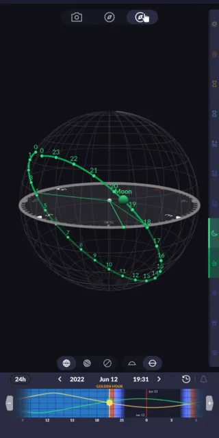

Screenshot of the free Ephemeris Sun & Moon app

### When and Where

The free [Ephemeris app](https://ephemeris.today/) showed me the exact time and location of where the moon was going to be. For my initial practice photos, I'll be shooting over tall trees, so I can wait until the moon is well over the horizon. A quick glance at the app tells me I can start snapping photos around 7:30 PM.

### Setup

At 7:15 PM, I walked outside and set up the camera on my tripod out in the driveway. I could see the moon behind the treetops, so it wouldn't be long now! I turned on the camera and then opened up the Imaging Edge Mobile app and connected via Bluetooth.

When you're shooting in low light and fully zoomed into 600mm, you have to do everything you can to reduce "camera shake". By pressing the shutter release button remotely, it means you can shoot at low ISOs, without the worry of blurry images from pressing a physical button on the camera.

The moon was now high enough to get a clear shot! I peered through the viewfinder and dialed in the focus. I could not believe how fast the moon was moving through the viewfinder at 600mm, this meant a long exposure was out of the question. Finally, I dialed in my exposure settings…

- f/6.3
- 1/125 sec
- ISO 100
- Drive Mode: Single
- Compressed RAW
  …and pressed the shutter release button on the app:

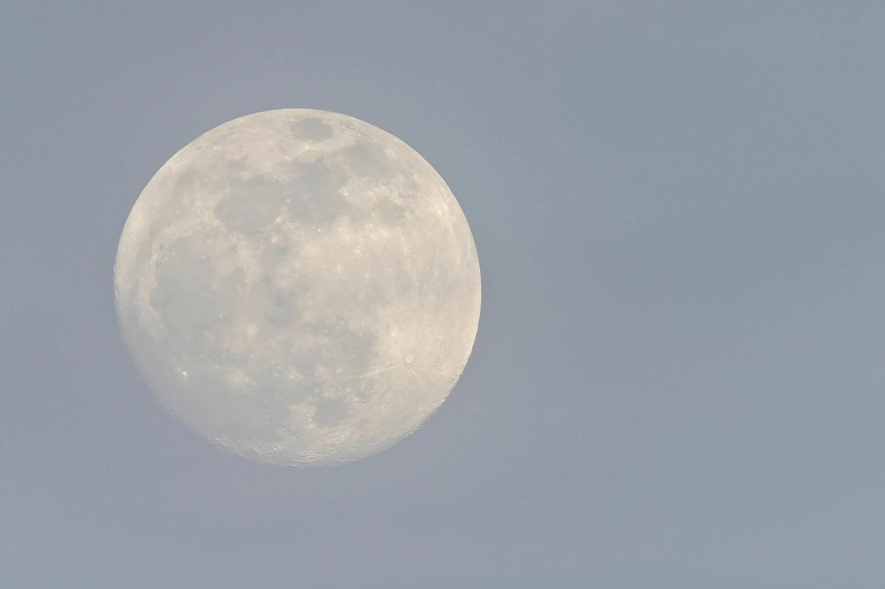

Cropped with exposure edits in ON1. f/6.3, 1/125 sec, ISO 100, 600mm Boom! ???? In focus? ✅ Correct-ish exposure? Mostly. Did I have fun? ✅

I think this turned out really well for a first try, but summer in Southeast Alabama means the heat and humidity work together to produce incredibly hazy skies. Even though the photo above is in focus (and shows plenty of detail), it is also obfuscated by a ridiculous amount of water in the air. Next time, I'll try to break through the haze with a slower exposure at f/11 or f/22.

### Exposure Bracketing

Time to try some different combinations of [exposure bracketing](https://phlearn.com/magazine/exposure-bracketing-the-ultimate-guide-to-bracketed-photography/) to see which works best. As I said, the moon moves _really fast_ when zoomed into 600mm and low light means slower shutter speeds, so a 9-shot bracket was out of the question. Even a 5-shot bracket is probably going to take too long. Let's see how they turned out.

I wanted as much detail as possible, so I would be shooting at…

- f/22
- ISO 50
- Drive Mode: Bracket 1EV
- Compressed RAW
  Once I adjusted my focus, I tapped the shutter release button on the app for the next 30 minutes.

### Bracketing Results

As I expected, the 5-shot brackets didn't quite turn out. It simply takes too long for the camera to cycle through 5 different exposures, plus the EV -2 photo (far left) is barely visible.

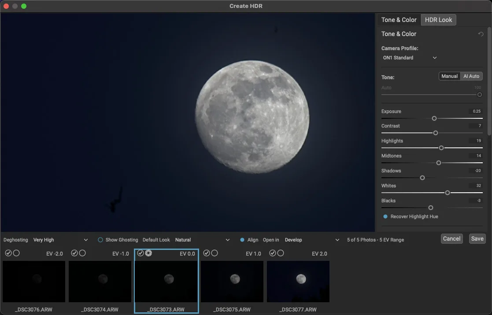

A screenshot of a 5-shot exposure bracket in ON1 Check out the deghosting overlay:

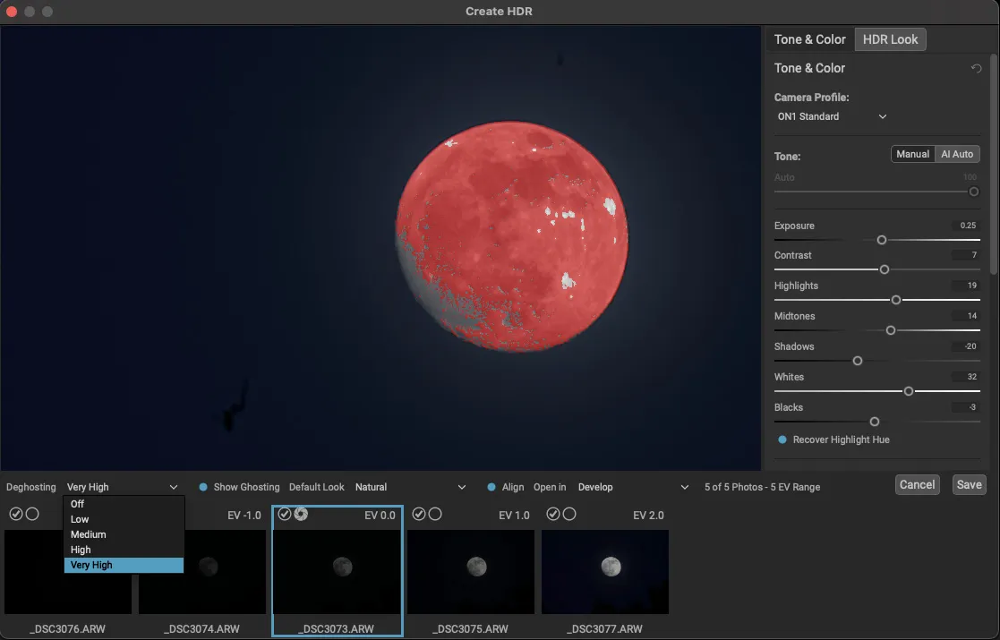

A screenshot of a 5-shot exposure bracket with deghosting overlay in ON1 All the red means the image editing software, [ON1](https://on1.sjv.io/oe3kgO), is trying to "figure out" which pixels to merge. The result is _kind of_ a blurry mess:

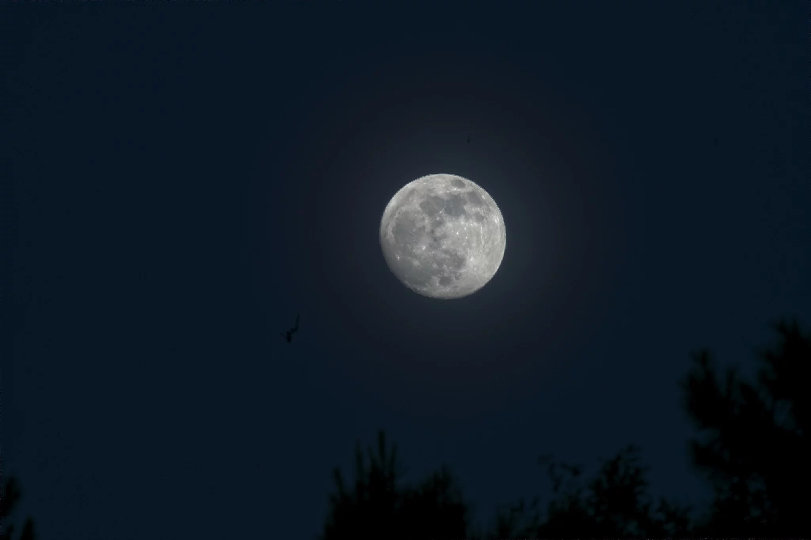

Click to view a larger image of a 5-shot exposure bracket of the moon As I suspected, the 3 shot worked much better. The EV +1 was bright, the EV -1 was just dark enough and EV 0 was perfectly exposed.

A screenshot of a 3-shot exposure bracket in ON1 The deghosting was minimal, so the photo will be sharper after it's merged.

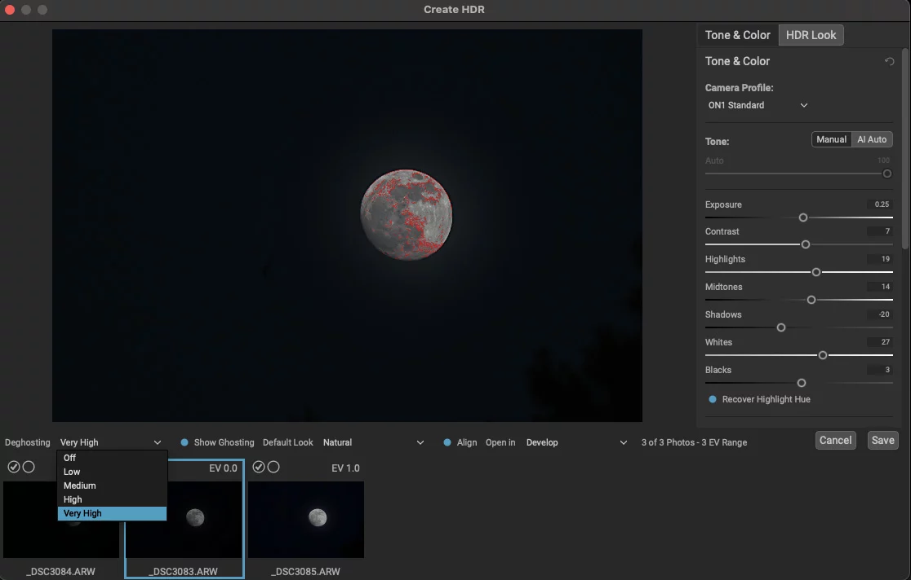

A screenshot of a 3-shot exposure bracket with deghosting overlay in ON1 The result is a delightful HDR moon with a bit of a glow:

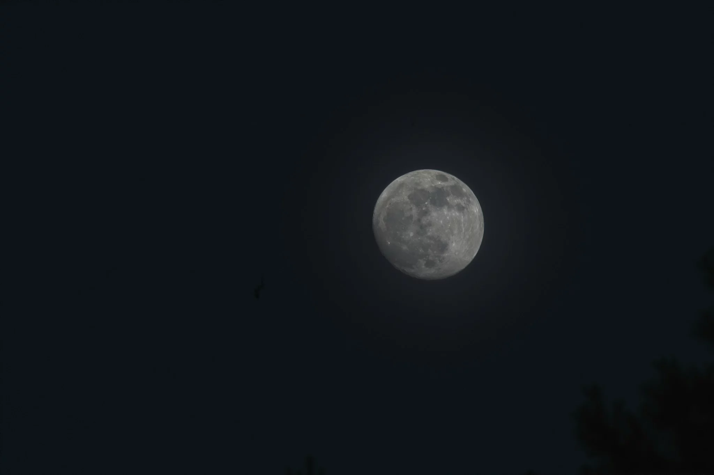

Click to view a larger image of a 3-shot exposure bracket of the moon I think that's enough practice for one night. Time to take some notes, clean off all the sensor dust, and get ready for…

## Practice – June 13

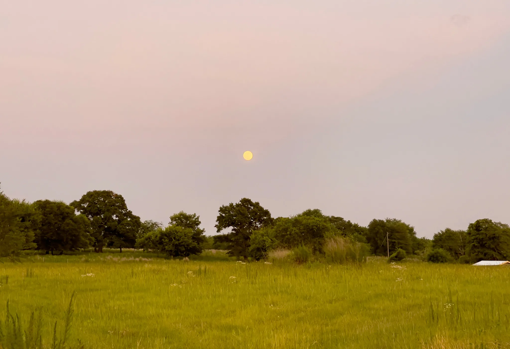

A view of the supermoon coming over the treetops. Photo by Chloe. Shot on iPhone™ Now that I've tested and established a baseline for exposure and bracketing, I'm off to scout a location to get the _HDR supermoon with a tree in the foreground_ shot.

Once again, a quick check of Ephemeris showed the moon breaching the horizon around 7:20 PM. After dinner, I went ahead and turned the camera on, and set the drive mode to 3-shot/1EV bracket. I also connected the Imaging Mobile App and put the camera on the tripod. I didn't want to mess with this on location!

Finally, my daughter Chloe and I jumped in the minivan and headed out. We found a nice spot with an open field and some trees. The moon was just coming over the top of the trees, so I found a safe spot on the side of the road and got right down to business.

### Exposure Bracketing

Looking through the viewfinder I found the composition I wanted. Moon. Trees. Centered. The problem was at f/22 the camera would have required a 2-second exposure. That's too slow considering the wind is blowing tree leaves around, plus the moon is moving too! I tried f/11 and f/8 it was still too slow. I didn't want to drive my ISO past 3200, so I'm gonna have to shoot this wide open.

With my exposure settings to…

- f/5.6
- 1/250 sec
- ISO 3200
- 200mm
- Drive Mode: Bracket 1EV
- Compressed RAW
  …I tapped the shutter release on my phone. Click. Click Click.

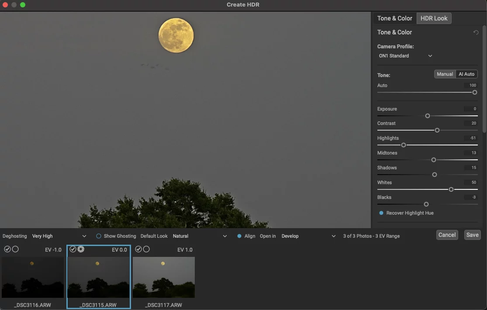

A screenshot of a 3 shot exposure bracket of the moon and a tree Whoa! That's not sensor dust, that's a flock of birds flying underneath the moon!

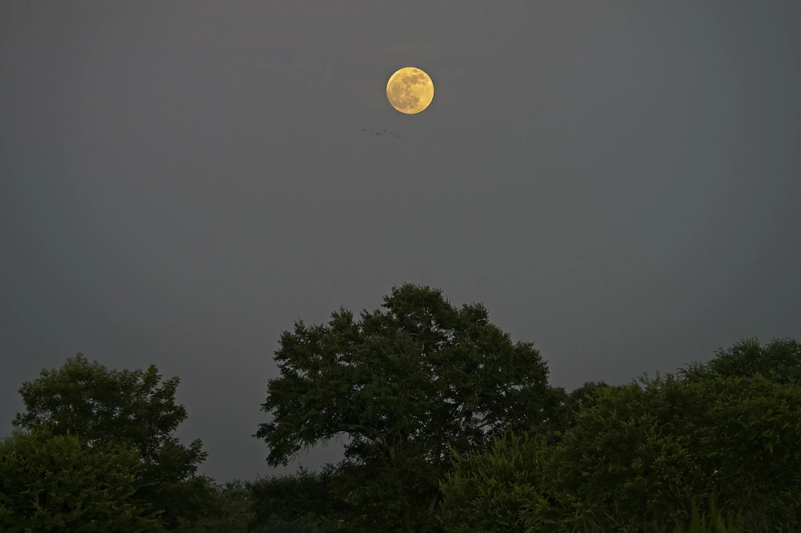

A 3-shot exposure bracket. Edited to taste in ON1. f/5.6, 1/125 sec, ISO 3200, 200mm Although I'm not totally happy with the composition, I wanted a single tree in the foreground, not a row of them. The final edit was exposed properly though and I felt good about tomorrow night.

### Single Shot

My friend and fellow pixel-peeping photographer [Oliver Harrison](https://www.positivebias.com/) always says, "every photograph is a compromise" because that's just how [the exposure triangle](https://www.exposuretriangle.com/) works. With the HDR bracket, I had to shoot wide open and at a higher ISO to compensate for the leaves moving on the trees.

Zoomed into the moon though? I don't have to compromise as much. Tonight's camera settings…

- f/11
- 1/20 sec
- ISO 50
- 600mm
- Drive Mode: Single
- Compressed RAW
  … produced a killer shot with some purple from the sunset sky.

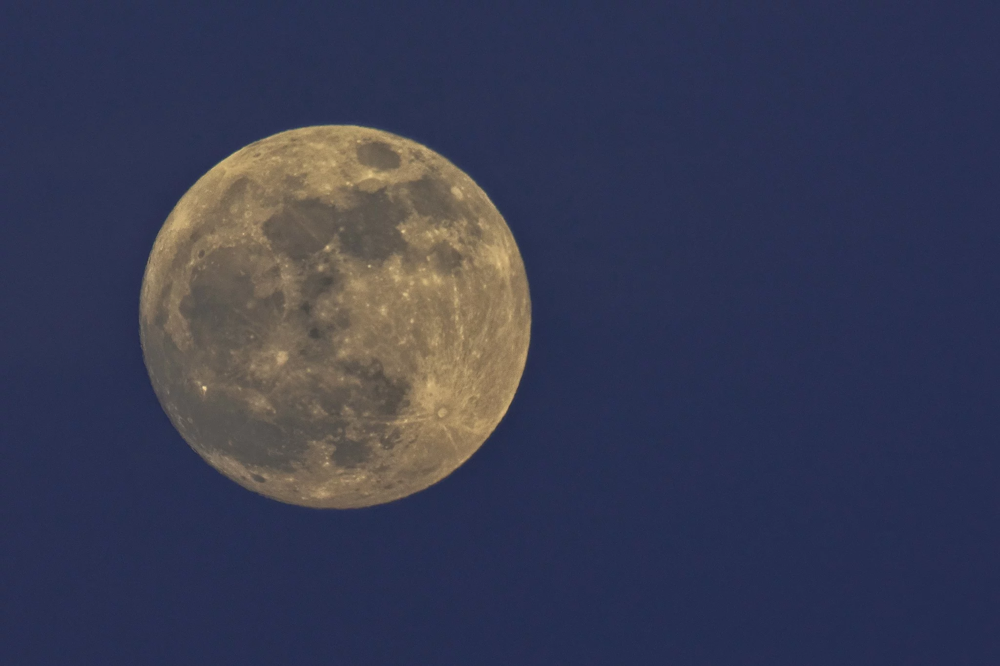

A single shot of the nearly-supermoon. f/11, 1/20 sec, ISO 50, 600mm Satisfied, Chloe and I packed up the camera and drove back home. We had fun and we felt ready for the big day (er, night) tomorrow!

### Compressed vs. Uncompressed RAW

Later that evening Tara and I had the TV on and I was researching the difference between Compressed vs. Uncompressed RAW. I honestly didn't know. All I knew was my Sony A7R IV was set to Compressed.

Turns out, Uncompressed RAW offers more dynamic range (14-bit), which is essential for lifting details out of the shadows (dark areas of a photo). These files, while twice as large, are actually easier to edit because there's no compression[2].

According to Sony[3], _Compressed RAW (12-bit) is recommended when you want to shoot continuously at the maximum speeds or preserve disk space._

I don't want to do either of those things right now!

### One Last Practice Shot

Having just had my mind blown, I ran back outside toward the brilliance of the nearly supermoon. I changed my camera to shoot Uncompressed RAW and set up for another 3-shot exposure bracket. This time, low and slow…

- f/29
- 1/15 sec
- ISO 50
- 600mm
- Drive Mode: Bracket 1EV
- Uncompressed RAW
  … and good gracious this image is now a portfolio piece.

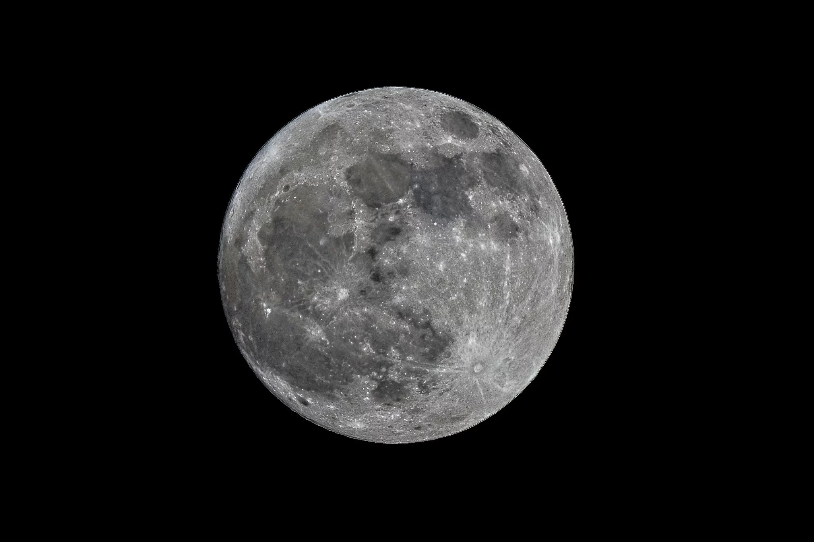

Super Strawberry Moon – June 2022. f/29, 1/15 sec, ISO 50, 600mm

## Strawberry Supermoon – June 14

All the money spent on a camera, lens, and tripod, and the hours spent learning, researching, and practicing all came down to this night. Getting a shot of the Strawberry Supermoon with my new camera and lens!

Well, it rained. All day. It was still cloudy by nightfall. I didn't couldn't get the shot. I did not have fun. Even Chloe was bummed out.

BUT… I did learn. I also made a memory or two with my kiddos. Plus, there are two more supermoons this summer!

- [Super Buck Moon](https://www.timeanddate.com/news/astronomy/super-buck-moon-2022) on July 13 at 14:27 ET
- [Super Sturgeon Moon](https://www.timeanddate.com/astronomy/moon/sturgeon.html) on Aug. 12 at 21:36 ET
  If anything, this gives me more time to practice…and practice makes perfect. Weather permitting, I can't wait to take another photo of a Supermoon.

**_Sources_**

[[1](https://www.oregonlive.com/weather/2022/06/7-surreal-photos-of-last-weeks-supermoon-strawberry-moon.html)] [[2](https://www.sony.co.uk/electronics/support/articles/00257081)] [[3](https://www.sony.co.uk/electronics/support/articles/00257081)]
