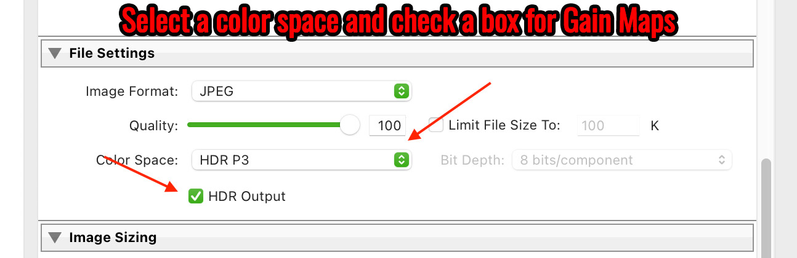
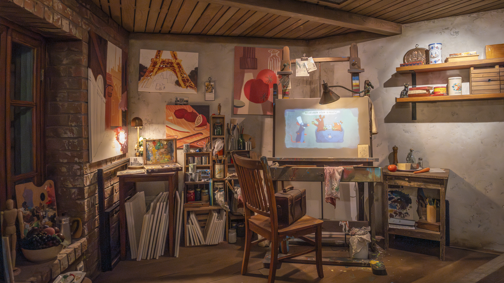
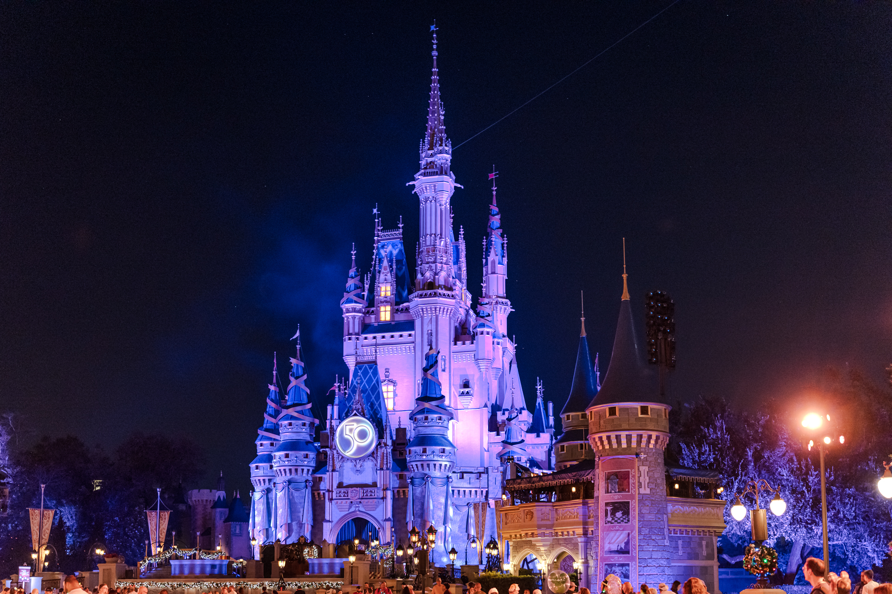

High Dynamic Range (HDR) photos, displaying a wider range of brightness, contrast, and colors than Standard Dynamic Range (SDR), come to life on HDR-capable screens. With brighter highlights, detailed shadows, and vibrant colors, they convey a deeper sense of realism. This enhanced visual storytelling allows photographers to share a richer reflection of their experiences, capturing the essence of the moment.

## A Brief History

For many years there have been two other types of "HDR" in photography. The over-the-top saturated photos from 2012:

To modern photos captured via [exposure bracketing](https://helpx.adobe.com/lightroom-classic/help/hdr-photo-merge.html) and merged using a technique called [HDR photo merge](https://helpx.adobe.com/lightroom-classic/help/hdr-photo-merge.html):

<figure className="alignwide">
  
  <figcaption>
    An HDR photo merge using Adobe Lightroom (SDR) | Sony a7R IVA | Tamron
    35-150mm | 1 sec, f/2.8, ISO 100
  </figcaption>
</figure>

This post is not about those HDR pretenders though, because at the end of the day: **the two photos above only have 8 bits worth of data and are in the sRGB colorspace**.

This post is about _true_ High Dynamic Range photos, which are in a larger colorspace and are shown at a much higher luminance.

## The Need For More Nits and Bits

Most images on the web only contain 8 bits worth of information and are in the sRGB color space. That's strictly a technical limitation of older web-based image formats like .jpg. But did you know that **cameras have been capturing RAW photos with more than 8 bits (and in larger colorspace) going back 20+ years!?**

The problem was that there was no practical way to "work" with those extra bits (or even view them on a display). So .jpg and PNG images simply discard everything "extra" to maximize compression back when the data on the Internet was sent over copper.

Fast forward to today, where the Internet is fast, and HDR-capable displays are everywhere (smartphones, tablets, TVs, and laptops). Not only can these devices render all the colors contained in larger color spaces like DCI-P3, Adobe RGB, Rec.2020, but they also have many times the peak brightness as SDR displays giving us the ability to view HDR content. Additionally, emerging image formats like AVIF and JPEG XL can hold more bits and retain high quality thanks to modern compression algorithms.

For example, the iPhone 16 Pro supports 1,200 nits (HDR) of brightness and 2,000 nits (outdoors). The current MacBook Pros can support 1,600 nits for HDR content. In comparison, the best-selling LCD monitor on Amazon only supports 250 nits.

Even though modern displays have the ability to display true HDR photos, and that data already present in RAW files, **the missing link has been a photo editor capable of editing in true HDR.**

## Adobe To The Rescue

In October 2022, Adobe [released a technology preview](https://helpx.adobe.com/mt/camera-raw/using/whats-new/2023.html) of their High Dynamic Range Output in Adobe Camera Raw. This preview allowed Photographers to experiment with exporting images greater than 8-bit and viewing them on HDR-supported displays. The workflow was a bit cumbersome though and browser support was lacking, so for the last year, there wasn't much you could do with your HDR photos except view them on your own computer.

In October 2023, Adobe [released a new version](https://helpx.adobe.com/lightroom-classic/help/whats-new/2024.html) of Lightroom Classic that brought full support for [editing and displaying HDR](https://helpx.adobe.com/mt/camera-raw/using/hdr-output.html) photos. **Finally, the missing link has been found!**

## What Are Gain Maps?

Without getting too technical, **a gain map is a tool in image processing used to adjust the intensity or brightness of an image**. It's a matrix of values that, when applied, multiply the original pixel values to brighten or darken different areas of the image independently. This allows improved shadow and highlight rendering and preparing images for further analysis in applications like medical imaging and machine vision systems.

If you want to deep dive into the technical side, check out the [full spec](https://helpx.adobe.com/camera-raw/using/gain-map.html) and visit Greg Benz's website to learn all about the [technical details](https://gregbenzphotography.com/hdr-images/jpg-hdr-gain-maps-in-adobe-camera-raw/). If you want a basic introduction to HDR, Greg also has an awesome page that [explains everything](https://gregbenzphotography.com/hdr/) and an [example gallery](https://gregbenzphotography.com/hdr-gain-map-gallery/) featuring beautiful HDR photos. His name, Greg, also slaps. Check it out!

## Ok, Gain Maps sound interesting.

So what? If a user's web browser can read a Gain Map and the device they're viewing with can display it, the user will see the full HDR version of the photo you're sharing. Otherwise, the web browser will automatically revert to the standard SDR version. This advancement means that as a photographer, **you can export a single image today with support for both HDR and SDR, saving you from additional work in the future**.

## Examples

While on vacation at Disney World, I snapped this photo while in the queue for Remy's Ratatouille Adventure at EPCOT. (BTW: I love this scene because who wouldn't want to have a studio space this lovely?)

This first image is a regular 'ol JPG right out of Lightroom:

Here is the same image, edited with Lightroom's new HDR sliders and exported as a JPG with a Gain Map:

The difference is subtle, the light from the lamps is not only brighter but there's also no banding. Remy's chef hat is a brilliant white, and matches what I saw in person, not a dull shade of blue.

Finally, here is the same image exported as an AVIF with a Gain Map:

**If all three of the images look the same, it's because you may have an incompatible web browser or a non-HDR display.** But that's the beauty of Gain Maps! You can still see the SDR version because it is baked right into the same file!

This next example is one of my favorite photos: Christmas at Hollywood Studios on Hollywood Boulevard. With all the decorations and lights, the neon, sounds, smells, dramatic clouds overhead. This moment was _electric!!_

Unfortunately, the SDR version does not do this scene justice. It simply fails to fully capture the brilliance and the ambiance of standing on Hollywood Boulevard at Christmas time.

The HDR version does a much better job though! **It is a much closer representation of what my eye saw and how I felt at that moment.** As a photographer, isn't that exactly what we're trying to do?

Here's a photo of Cinderella's Castle right before the fireworks. The SDR version captures the various shades of purples being projected onto the castle. It's just okay though.

And here is the HDR version…

Even at a higher ISO, Lightroom's HDR workflow is able to bring up the vibrance of the street lamps, the back-lit "50" on the front of the castle, and reduces the banding in the shades of purple. It took an "okay" photo and made it a bit more interesting.

## Too Much of a Good Thing

It's very easy to overdo it with the HDR "highlights" and "whites" sliders in Lightroom, as I did in this photo from Indiana Jones™️ Epic Stunt Spectacular. I cranked it to eleven!

<figure className="alignwide">
  
  <figcaption>
    An explosion during Indiana Jones™️ Epic Stunt Spectacular. HDR (JPG) | Sony
    a7R IVA | Tamron 35-150mm | 1/1250 sec, f/4, ISO 160
  </figcaption>
</figure>

If you're not careful, your photo may end up looking unrealistic and overly processed (like those terrible "HDR" images from 2012). My recommendation would be to keep your editing tasteful so you don't blind your viewers!

## But Can I Print in HDR?

Sadly, no. This is a physical limitation, not a technical one. We simply can't make photo paper any brighter, the same way an HDR display can increase the brightness of individual pixels.

## This Sounds Cool, Tell Me About Browser / App / CMS Support

The short answer is software is still catching up to the hardware. As of fall 2024…

**Photo Editors**

- Newer versions of Adobe Photoshop, Lightroom, and Camera Raw have [full support](https://blog.adobe.com/en/publish/2023/10/10/hdr-explained) for editing (and exporting) images that include a Gain Map in either P3 or Rec.2020 color spaces.
- Affinity Photo also supports Gain Maps (but they call it tone mapping)
- iOS Photos App supports Gain Maps

**Image Formats**

- JPG (best browser support)
- AVIF (an emerging format with good browser support and better compression than JPG)
- HEIF (another emerging format, but limited browser support)
- JPEG XL (was a dead format, but Apple is trying to [bring it back](https://petapixel.com/2024/09/18/why-apple-uses-jpeg-xl-in-the-iphone-16-and-what-it-means-for-your-photos/))

**Web browsers**

- Chrome-based web browsers (Chrome, Edge, Brave) on version 116+ have full support.
- Opera has full support.
- Safari support is presumably on the way? (iOS 17 Photos app now [has support for Gain Maps](https://developer.apple.com/documentation/appkit/images_and_pdf/applying_apple_hdr_effect_to_your_photos) and iOS 18 brought HDR support to messages and the camera app)
- Firefox is unknown at this time, but there has been a [bug report filed](https://bugzilla.mozilla.org/show_bug.cgi?id=1832622).

**Social Media**

- Instagram and Threads support Gain Maps and HDR photos
- Facebook does not

**Content Management Systems**

- WordPress, the web's most popular CMS, fully supports Gain Maps.

**HDR Capable Displays**

- MacBook Pro's, starting with the M1
- Smartphones and tablets, including iPhone, iPad, Samsung Galaxy, and Google Pixel
- Apple XDR Pro display
- Modern TVs or monitors that support HDR10, HDR10+, HLG, and Dolby Vision

## Wrap Up

The journey of HDR, from its early exaggerated renditions to its now more nuanced and true-to-life representations, truly showcases the remarkable path of photographic evolution. **With technology finally catching up to the nuances of human vision, photographers are now equipped with tools that break past previous digital boundaries.** The increasing support for HDR and Gain Maps across various platforms and software is a testament to the evolving landscape of digital photography.

Whether you are a professional photographer or a hobbyist, the realm of HDR opens up a canvas of possibilities, enabling a more authentic translation of our visual experiences. I will definitely be using Lightroom's new HDR workflow going forward.

Thanks for reading and cheers! 📸
