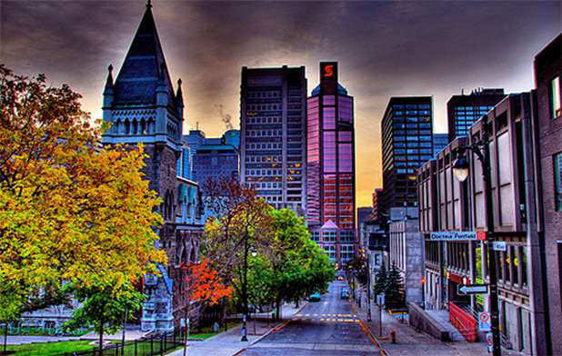
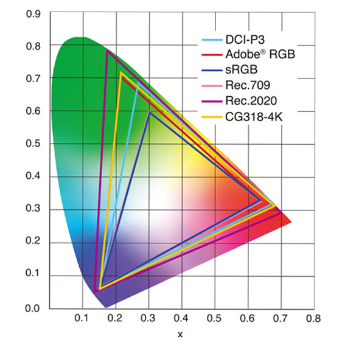
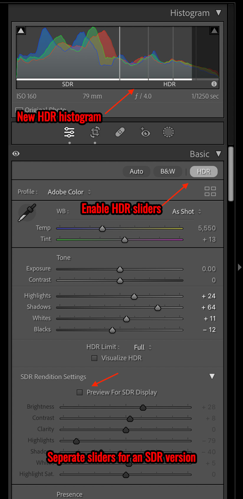
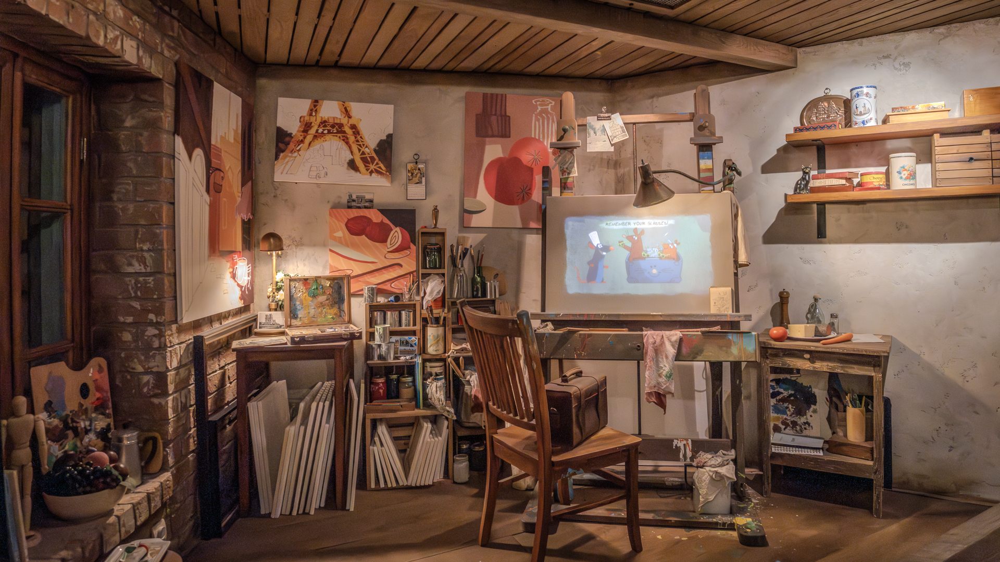
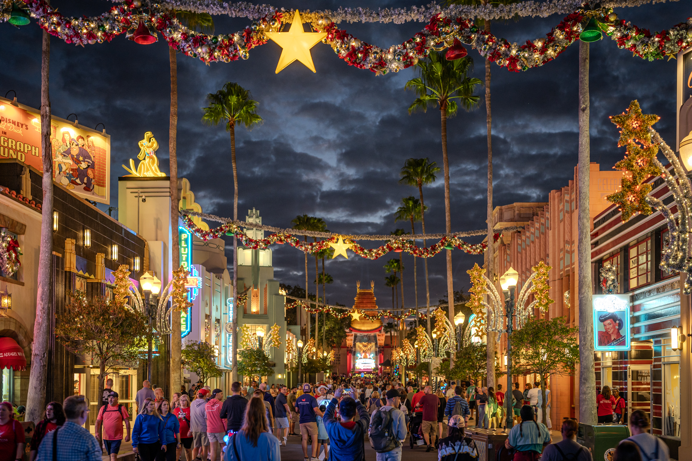
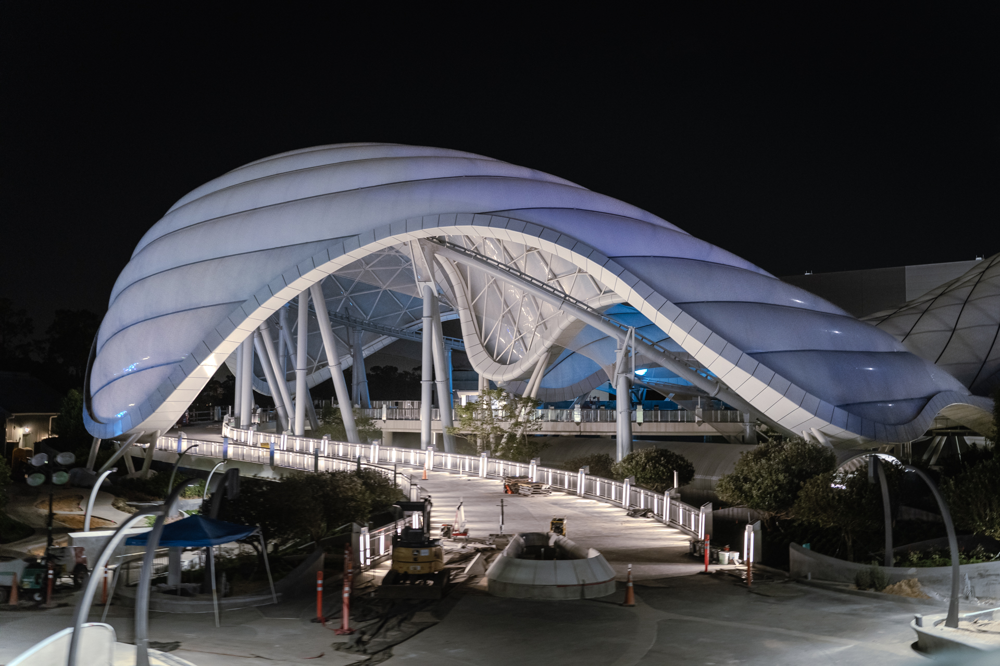

High Dynamic Range (HDR) photos display a wider range of brightness, contrast, and color than Standard Dynamic Range (SDR). On an HDR-capable screen, that difference is visible: brighter highlights, more detail in shadows, and colors that more closely match what the camera actually captured.

## A Brief History

For many years there have been two other types of "HDR" in photography. The over-the-top saturated photos from 2012:

To modern photos captured via [exposure bracketing](https://helpx.adobe.com/lightroom-classic/help/hdr-photo-merge.html) and merged using a technique called [HDR photo merge](https://helpx.adobe.com/lightroom-classic/help/hdr-photo-merge.html):

<figure className="alignwide">
  
  <figcaption>
    An HDR photo merge using Adobe Lightroom (SDR) | Sony a7R IVA | Tamron
    35-150mm | 1 sec, f/2.8, ISO 100
  </figcaption>
</figure>

This post is not about those HDR pretenders though, because at the end of the day: **the two photos above only have 8 bits worth of data and are in the sRGB colorspace**.

This post is about _true_ High Dynamic Range photos, which are in a larger colorspace and are shown at a much higher luminance.

## The Need For More Nits and Bits

Most images on the web only contain 8 bits worth of information and are in the sRGB color space. That's strictly a technical limitation of older web-based image formats like .jpg. But did you know that cameras have been capturing RAW photos with more than 8 bits (and in larger colorspace) going back 20+ years?! The extra data was there, but it was essentially invisible to photographers and viewers alike.

<figure>
  
  <figcaption>
    A graph plotting various color spaces and how they relate to the visible
    color spectrum. Note how sRGB is a small triangle compared to the larger
    DCI-P3 and Rec.2020 color spaces.
  </figcaption>
</figure>

The problem was that there was no practical way to work with those extra bits or view them on a display. So .jpg and PNG images simply discard everything extra to maximize compression, back when most internet traffic moved over copper.

Today, HDR-capable displays are everywhere: smartphones, tablets, TVs, laptops, and monitors. These devices can render colors from larger color spaces like DCI-P3, Adobe RGB, and Rec.2020, and they reach peak brightness levels that SDR displays cannot match. Emerging image formats like AVIF and JPEG XL can hold more bits and retain quality through modern compression.

For reference: the iPhone 16 Pro supports 1,200 nits (HDR) and 2,000 nits outdoors. Current MacBook Pros support 1,600 nits for HDR content. The best-selling LCD monitor on Amazon supports 250 nits.

Even with that hardware in place and the extra data already present in RAW files, the missing link has been a photo editor capable of editing in true HDR.

## What Are Gain Maps?

A gain map is a matrix of values applied to an image that multiplies pixel brightness independently across different areas. This lets a single image file carry two versions: a full HDR rendition and a standard SDR fallback. If a viewer's browser and display support HDR, they see the HDR version. If not, the browser serves the SDR version automatically.

Because both versions live in one file, you export once and get coverage across HDR and SDR displays without managing separate files. As HDR display support expands, your existing exports are already ready for it.

## Adobe Lightroom Support

In October 2022, Adobe [released a technology preview](https://helpx.adobe.com/mt/camera-raw/using/whats-new/2023.html) of High Dynamic Range Output in Adobe Camera Raw. It let photographers experiment with exporting images above 8-bit and viewing them on HDR displays, but the workflow was cumbersome and browser support was limited.

In October 2023, Adobe [released a new version of Lightroom Classic](https://helpx.adobe.com/lightroom-classic/help/whats-new/2024.html) with full support for [editing and exporting HDR](https://helpx.adobe.com/mt/camera-raw/using/hdr-output.html) photos. That filled the gap.

The new HDR workflow in Lightroom adds HDR-specific sliders to the editing panel:

<figure>
  
  <figcaption>
    A screenshot of Adobe Lightroom Classic's new HDR histogram and sliders
  </figcaption>
</figure>

At export, you can select a color space and toggle HDR Output to include a Gain Map:

<figure>
  
  <figcaption>
    A screenshot of Adobe Lightroom's new HDR export options, including Gain
    Maps and color space choices.
  </figcaption>
</figure>

You can use this workflow on most any RAW photo dating back 20+ years, and the HDR sliders will adjust the Gain Map values to reflect your edits giving new life to old photos.

## Examples

While in the queue for Remy's Ratatouille Adventure at EPCOT, I took this photo of the scene set inside Remy's studio apartment.

This first image is a standard JPG exported from Lightroom:

Here is the same image, edited with Lightroom's HDR sliders and exported as a JPG with a Gain Map:

<figure className="alignwide">
  
  <figcaption>
    Remy's studio | HDR (JPG) | Sony a7R IVA | Sony 16-35mm PZ | 1/160 sec, f/4,
    ISO 10000
  </figcaption>
</figure>

The difference is subtle. The light from the lamps is brighter with no banding, and Remy's chef hat renders as a clean white rather than a dull blue-gray.

And the same image exported as an **AVIF** with a Gain Map:

**Note: If all three images look identical, your browser or display may not support HDR.** The SDR fallback is embedded in the same file, so you're still seeing a correct version of the photo.

This next photo is from Hollywood Boulevard at Hollywood Studios, shot during the Christmas season.

The SDR version loses the energy of the scene. The neon, the decorations, the dramatic clouds -- none of it comes through the way it looked standing there.

The HDR version is a closer match to what I actually saw:

<figure className="alignwide">
  
  <figcaption>
    Christmas at Hollywood Studios on Hollywood Boulevard. HDR (JPG) | Sony a7R
    IVA | Tamron 35-150mm | 1/40 sec, f/2, ISO 640
  </figcaption>
</figure>

Here's Cinderella's Castle before the fireworks, with the 50th Anniversary projections running. The SDR version captures the purple tones but not much else.

The HDR version brings out the street lamps, the back-lit "50" on the castle facade, and reduces the banding in the purple gradients.

<figure className="alignwide">
  
  <figcaption>
    Cinderella's Castle during the 50th Anniversary Celebration. HDR (JPG) |
    Sony a7R IVA | Tamron 35-150mm | 1/40 sec, f/2, ISO 2500
  </figcaption>
</figure>

## Too Much of a Good Thing

The HDR highlights and whites sliders are easy to overdo. This shot from Indiana Jones™️ Epic Stunt Spectacular is a good example of what happens when you push them too far.

SDR version:

HDR version, with the sliders pushed too hard:

<figure className="alignwide">
  
  <figcaption>
    An explosion during Indiana Jones™️ Epic Stunt Spectacular. HDR (JPG) | Sony
    a7R IVA | Tamron 35-150mm | 1/1250 sec, f/4, ISO 160
  </figcaption>
</figure>

The result looks processed and artificial, which puts it closer to the 2012-era HDR photos than anything you'd want to publish. Treat the HDR sliders the same way you would exposure or contrast: use enough to reflect what you saw, not to demonstrate that the sliders exist.

## But Can I Print in HDR?

No. This is a physical limitation, not a technical one. Photo paper cannot increase its own brightness the way an HDR display can boost individual pixels.

## Browser, App, and CMS Support

Software support is still catching up to hardware. Here's the current state as of early 2026:

**Photo Editors**

- Adobe Photoshop, Lightroom, and Camera Raw: [full support](https://blog.adobe.com/en/publish/2023/10/10/hdr-explained) for editing and exporting with Gain Maps in P3 and Rec.2020 color spaces
- Affinity Photo: supports Gain Maps (listed as tone mapping)
- iOS Photos App: supports Gain Maps
- Davinci Resolve: full support
- Google Photos: full support
- Immich: full support

**Image Formats**

- JPG: best browser support
- AVIF: good browser support, better compression than JPG
- HEIF: limited browser support
- JPEG XL: limited support, though Apple is [pushing for broader adoption](https://petapixel.com/2024/09/18/why-apple-uses-jpeg-xl-in-the-iphone-16-and-what-it-means-for-your-photos/)

**Web Browsers**

- Chrome, Edge, Brave: full support
- Opera: full support
- Safari: full support in v26 - MacOS, iOS, iPadOS, etc
- Firefox: Still no support as of early 2026; a [bug report is open](https://bugzilla.mozilla.org/show_bug.cgi?id=1832622)

**Social Media**

- Instagram and Threads: full support
- Facebook: support for video only

**Content Management Systems**

- WordPress: full support

**HDR-Capable Displays**

- MacBook Pro (M1 and later)
- iPhone, iPad, Samsung Galaxy, Google Pixel
- Apple Pro Display XDR
- TVs and monitors supporting HDR10, HDR10+, HLG, or Dolby Vision

## Further Reading

Adobe's [Lightroom HDR documentation](https://helpx.adobe.com/lightroom-classic/help/hdr-output.html) covers the export workflow in detail. For the full technical spec, see Adobe's [Gain Map specification](https://helpx.adobe.com/camera-raw/using/gain-map.html). Greg Benz has written an in-depth breakdown of [JPG HDR Gain Maps in Camera Raw](https://gregbenzphotography.com/hdr-images/jpg-hdr-gain-maps-in-adobe-camera-raw/), a solid [HDR overview](https://gregbenzphotography.com/hdr/), and an [HDR example gallery](https://gregbenzphotography.com/hdr-gain-map-gallery/) worth browsing.

<figure className="alignwide">
  
  <figcaption>
    Tron Lightcycle Run at Magic Kingdom in HDR (JPG) | Sony a7R IVA | Tamron
    35-150mm | 1/40 sec, f/2, ISO 2500
  </figcaption>
</figure>

I'll be using Lightroom's HDR workflow going forward. If you're shooting RAW, the data is already there -- you just need the export pipeline to do something with it. Thanks for reading. 📸
