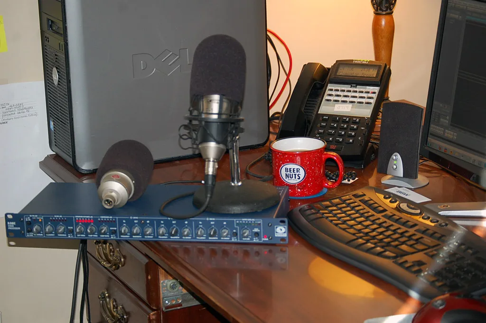
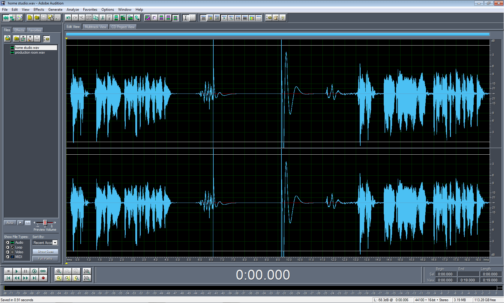
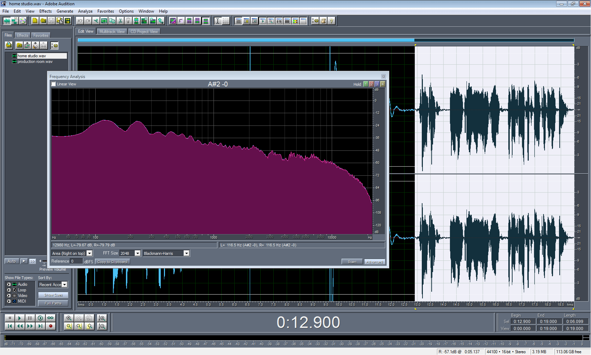
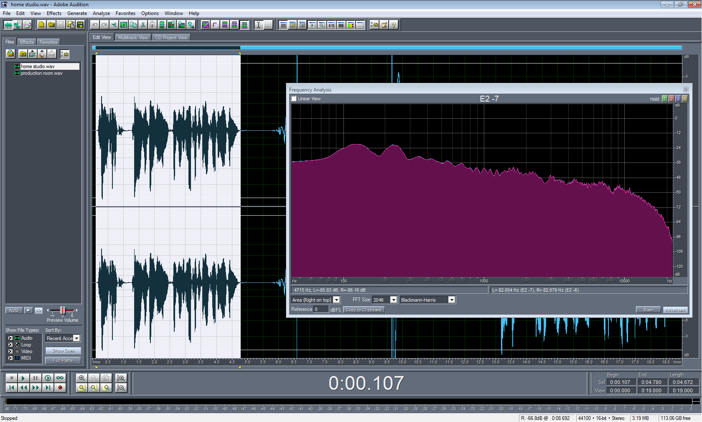
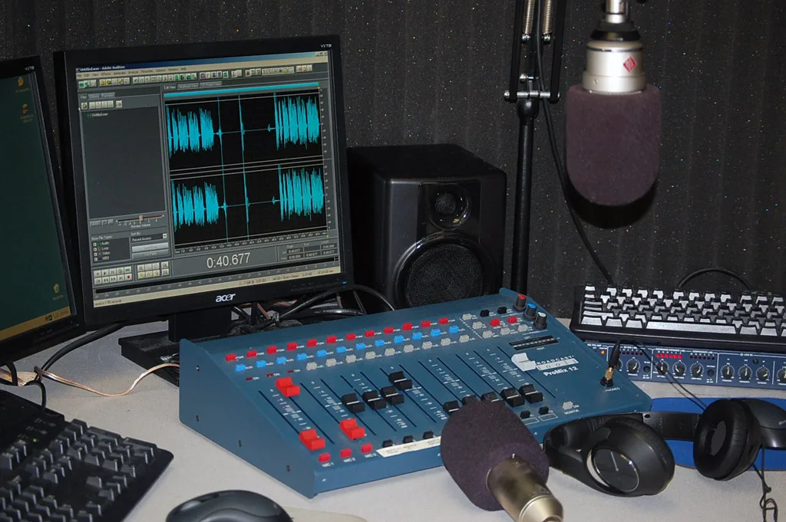
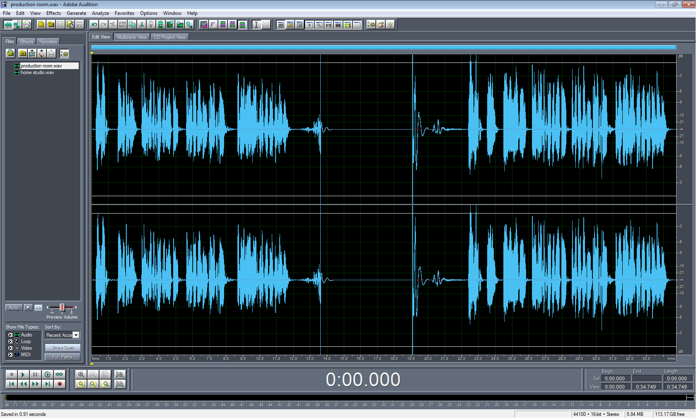
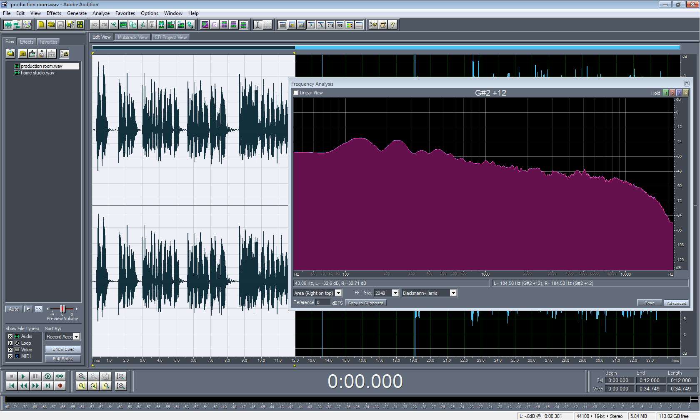
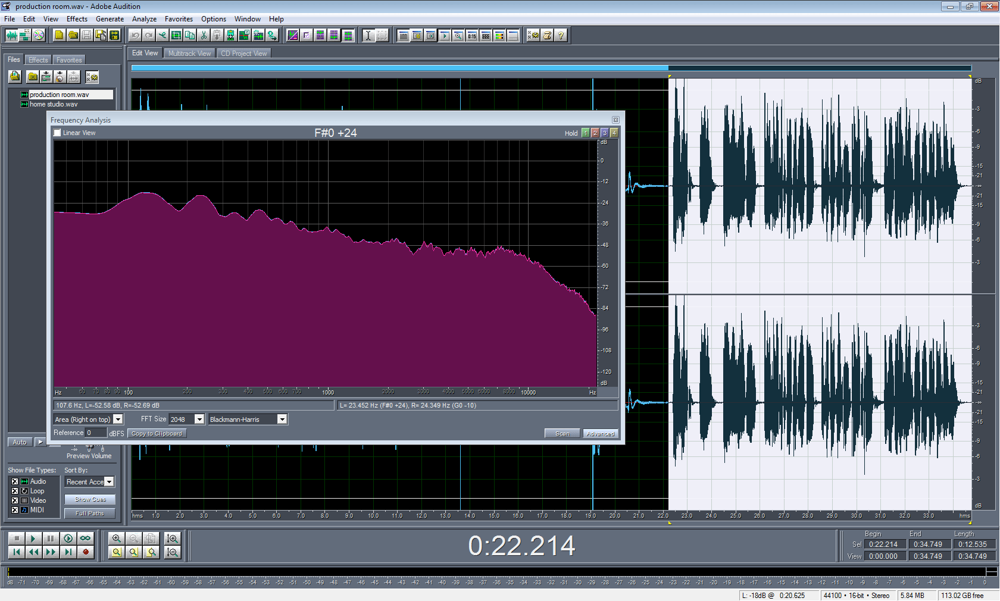

I'm a 15-year radio veteran. I've seen the debate between high-end and low-end microphones both in-person and on internet message boards. Usually, the argument ends with a snide remark like: _"The Behringer is crap because it's only $100 bucks!"_… That's not very scientific, so I wanted to study this on a technical level.

In my office is a [Behringer B-1](http://amzn.to/1boeY7p). I purchased it new in 2001 from [zzounds.com](https://www.zzounds.com/). It's widely known as a cheap, yet rugged starter microphone. I've used it to voice-track, cut voice-overs, and mic live instruments (the coolest being a 100-year-old cello). It's a tough microphone. The kind of microphone you can toss into the backseat on the way to a gig and not think twice.

The [Neumann TLM 103](http://amzn.to/1gBAeKA) is known as a high-end, yet affordable option for voice-over professionals. The Neumann name is known throughout the recording industry as _THE_ microphone for vocals. It's truly the Cadillac! There are three TLM 103s in the building, one in each production room. Many of our DJs have them in their home studios too. Note: most radio stations wouldn't dare spend $1,100 on a production room microphone.

What you're about to see (and hear) is me talking into both microphones – _unedited_. To prove that I'm not swapping voice processors, you'll even hear me changing out the microphones. I personally have no stake in the argument, I'm an engineer. I simply wanted to introduce a more technical point of view.

I grabbed the following specifications from each respective website.

## Technical Specifications

**Behringer B-1**

- Type: Condenser
- Frequency Response: 20 Hz – 20 kHz
- Pickup Pattern: Cardioid
- Diaphragm: 1-inch pressure-gradient transducer capsule
- Power: 48v Phantom
- Construction: Ultra low-noise transformerless circuitry
- Price: $99.00 USD ([Amazon](http://amzn.to/1boeY7p))
- [Website](https://www.behringer.com/product.html?modelCode=0504-AAB)

**Neumann TLM 103**

- Type: Condenser
- Frequency Response: 20 Hz – 20 kHz
- Pickup Pattern: Cardioid
- Diaphragm: 1-inch pressure-gradient transducer capsule
- Power: 48v Phantom
- Construction: Ultra low-noise transformerless circuitry
- Price: $1,099 USD ([Amazon](http://amzn.to/1gBAeKA))
- [Website](https://www.neumann.com/en-us/products/microphones/tlm-103)

Would you look at that? On paper, they both have the same specifications! Ok, I'm not going to dive into _exactly_ how those parts are made, or the quality of materials used, but they _should_ sound almost identical.

## Test 1: Basic Home Studio

With this test, I'm recreating a (very) basic home studio. There's no audio board, just the voice processor plugged into "Line-In" on the motherboard sound card. For both tests, the B-1 is set to "flat" as there is no low-frequency roll-off option on the TLM 103.

**Equipment:**

- Symetrix 528e Voice Processor
- On-Board High Definition Audio Card (Dell Optiplex 360)

**Adobe Audition Screen-shot:**

**Average Frequency Response:**

### Listen

<audio controls>
  <source src="./B1-vs-TLM-103-home-studio1.mp3" type="audio/mpeg">
</audio>

## Test 2: Production Room

Now, let's move into a real-live-working production room at a radio station. This room is "Prod 3". It is used daily to voice-track shows and cut commercials. It features a flat-response 12-channel mixer, and a professional-grade sound card – oh, and lots of foam on the walls.

_Note: I used the same exact Voice Processor in each test._

**Equipment:**

- Symetrix 528e Voice Processor
- Broadcast Tools ProMix 12
- Audio Science 4344 Sound Card

**Adobe Audition Screen-shot:**

**Average Frequency Response:**

## Listen

<audio controls>
  <source src="./B1-vs-TLM-103-production-room1.mp3" type="audio/mpeg">
</audio>

## Conclusion

It's obvious the production room environment _sounds_ better. That has nothing to do with the board, and everything to do with the professional sound card.

IMHO: The [B-1](http://amzn.to/1boeY7p) sounds brighter and a bit "punchy", while the [TLM 103](http://amzn.to/1gBAeKA) sounds warm and more "mellow". Overall, they're not that far apart. (Really) That's no surprise since their specifications and frequency responses are identical.

How? Quality of materials and parts used in construction.

What does that mean? Nothing. A Top-40 DJ might want to sound punchy, while a soft-rock DJ will want to sound warmer. Do you want to flaunt the name "Neumann" to owners of B-1s on message boards? Or do you want to have a fantastic-sounding microphone for less than $100? In the end, it's all about your budget and application.

A co-worker of mine, [John Garrett](https://www.facebook.com/john.g.yuhas), does voice-overs for a living. He started out with a [Behringer B-1](http://amzn.to/1boeY7p). He jokes about how that "starter microphone" made him a living for a few years. (Last year he purchased a [TLM 103](http://amzn.to/1gBAeKA)).

John Garrett's and my advice:

- Don't worry about the microphone as much as the gear surrounding it.
- Buy a high-quality [sound card or mixer](https://amzn.to/3aXMhDG). It will make your audio sound better long before you hook up the microphone.
- Buy an industry standard mic preamp like the [dbx 266xs](https://amzn.to/2uKZ2Rh) or [Symetrix 528e](http://amzn.to/GVhxVc).
- Use sound-dampening foam in your studio/room.
  When you're both successful and have some extra cash, then take the leap and get the [TLM 103](http://amzn.to/1gBAeKA). Just don't expect gigs to flood in because you own a $1,100 microphone.
