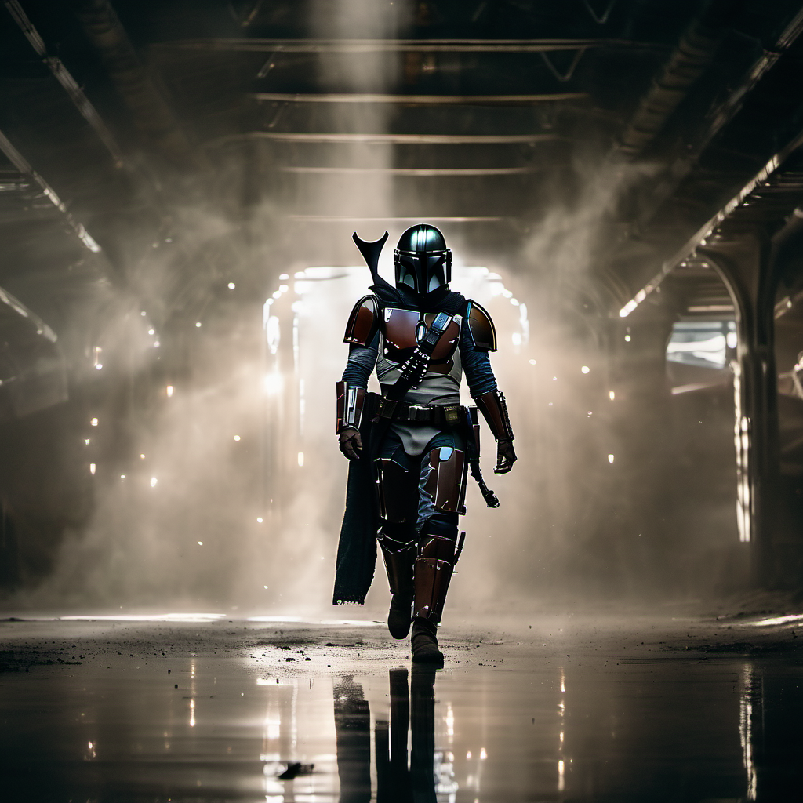
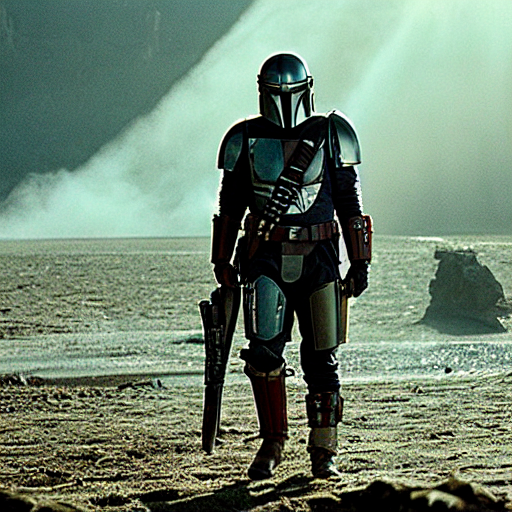
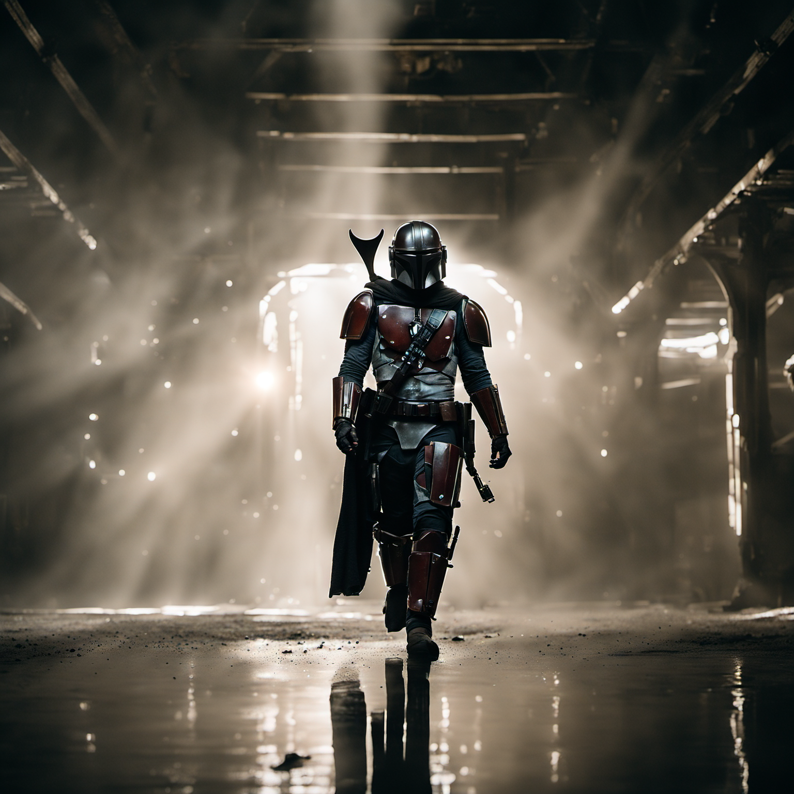
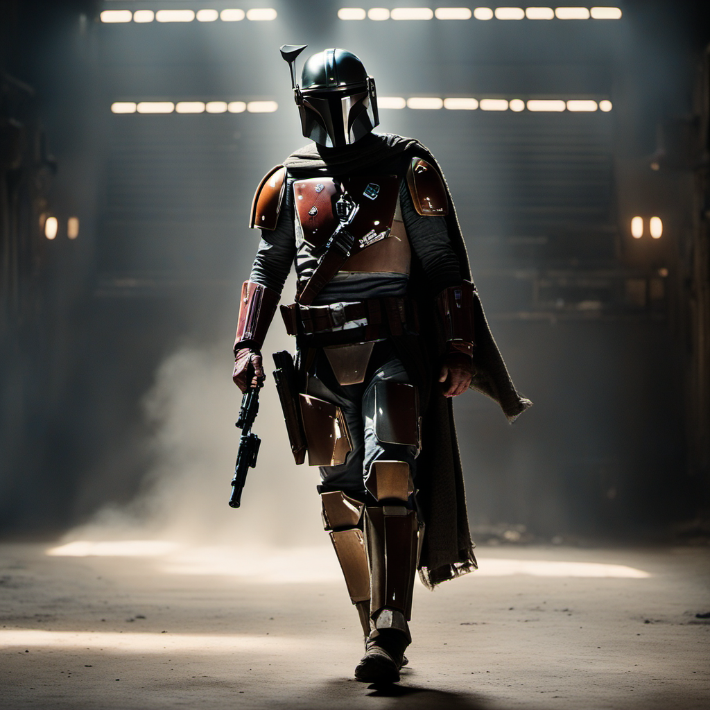
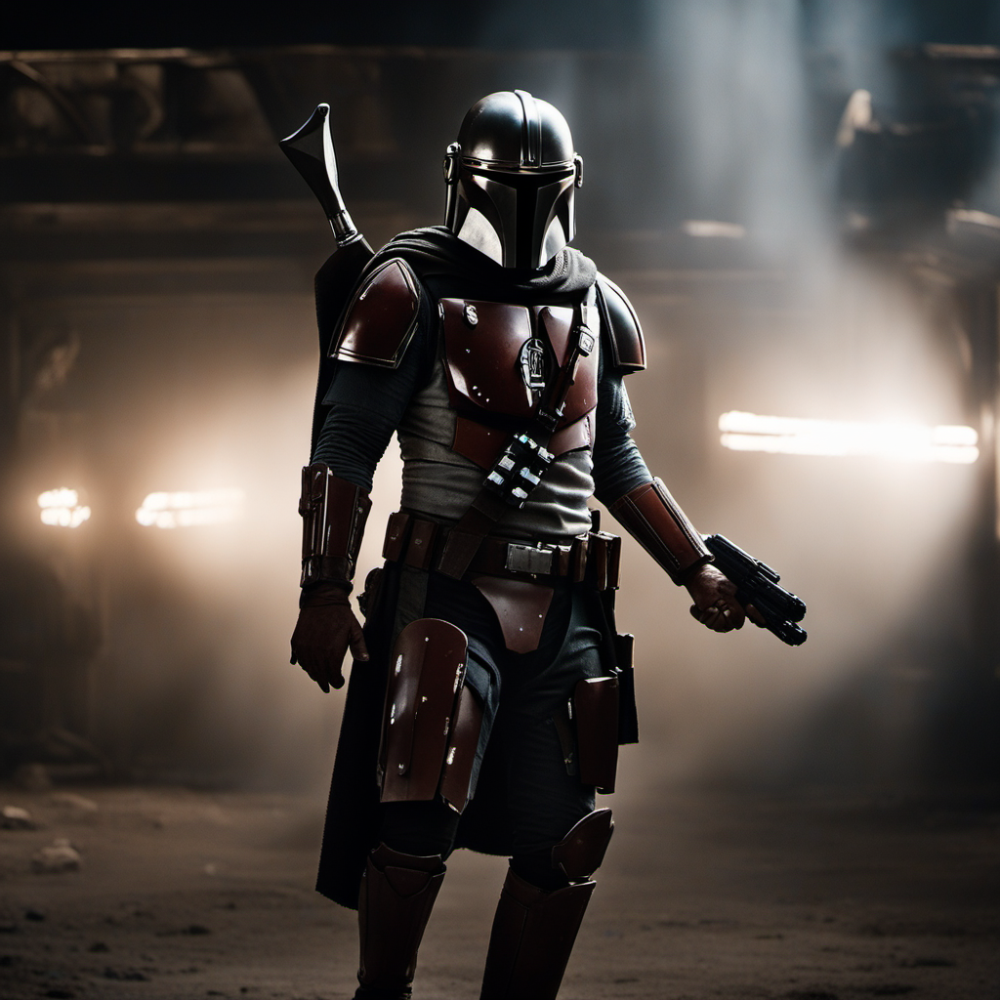
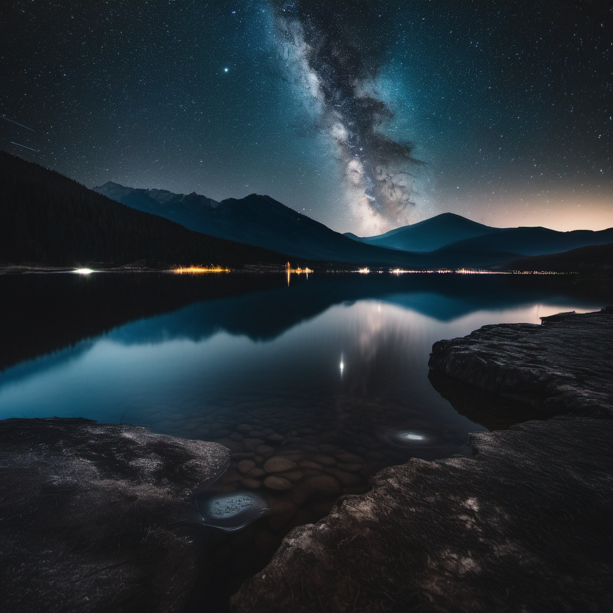
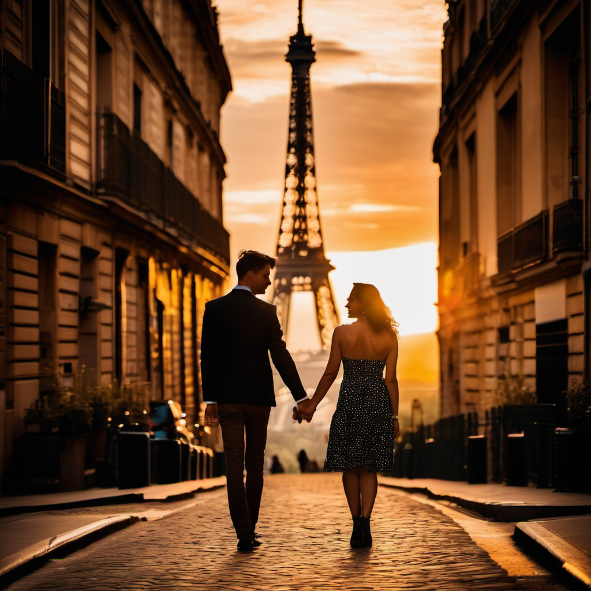
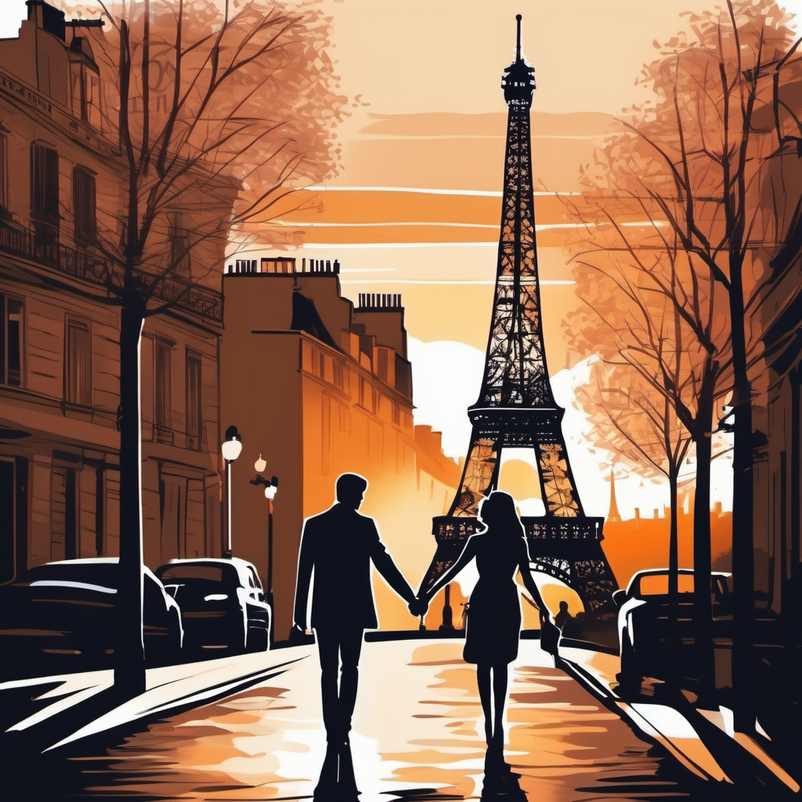

Yesterday, [Stable Diffusion XL 1.0 was released](https://stability.ai/blog/stable-diffusion-sdxl-1-announcement) (SDXL 1.0). The artificial intelligence (AI) tool is available in [open source on GitHub](https://github.com/Stability-AI/generative-models) and on its consumer apps [ClipDrop](https://clipdrop.co/stable-diffusion) and [DreamStudio](https://dreamstudio.ai/).

I must say, the updates are quite impressive. One of the most exciting enhancements for me is the increase in native image resolution from 512 pixels to 1024 pixels. Along with that, they have made prompt requirements simpler and more user-friendly.

> With SDXL, you only need to use a few words to create intricate and visually appealing images. There's no need to add additional terms like "masterpiece" to get high-quality results. Moreover, SDXL 1.0 is now capable of understanding the nuances between concepts, such as differentiating between "The Red Square" as a famous place and a "red square" as a simple shape.
>
> — stability.ai

## Image Tests

As for my own experience, I use [Automatic1111](https://github.com/AUTOMATIC1111/stable-diffusion-webui/) (A111) and [ComfyUI](https://github.com/comfyanonymous/ComfyUI) on my [2021 M1 Max Macbook Pro](https://support.apple.com/kb/SP858?locale=en_US) to generate AI images. Both A111 and ComfyUI now support SDXL 1.0. I updated to the latest version, downloaded the [Stable Diffusion XL 1.0 Base Model](https://huggingface.co/stabilityai/stable-diffusion-xl-base-1.0/blob/main/sd_xl_base_1.0.safetensors), and began experimenting with it.

### SDXL vs. SD 1.5

Here are the results of SDXL 1.0 compared to Stable Diffusion 1.5 (SD 1.5) using A111:

**Generation Info:**

```
The Mandalorian, walking, holding a blaster, particles and dust in beams of light, background of hanger bay, cinematic look, low key Negative Prompt: 3D render, illustration, cartoon Steps: 24, Sampler: DPM++ 2M Karras, CFG scale: 7, Seed: 1150972731, Size: 1024x1024, Model hash: 31e35c80fc, Model: sd_xl_base_1.0, Version: v1.5.1
```

 **SDXL 1.0 Result:**



SDXL 1.0 Base Model (1024x1024)

**SD 1.5 Result:**



SD 1.5 (512x512)

Wow! What a difference! 🤩 The SDXL image above took about 40 seconds to generate and turned out fantastic! It's unbelievable really!

In addition to releasing the SDXL 1.0 Base Model, stability.ai also released a refiner model. Based on [what I've read online](https://www.reddit.com/r/StableDiffusion/comments/15azdjo/comment/jto0kvp/?context=3), it seems the refiner model can be optionally run after the initial text2img was generated, as both an upscaler and to refine details. I downloaded the [Stable Diffusion XL 1.0 Refiner Model](https://huggingface.co/stabilityai/stable-diffusion-xl-refiner-1.0/blob/main/sd_xl_refiner_1.0.safetensors) and using A1111's img2img interface, I upscaled the original 1024x1024 image to 1536x1536 using the same prompts as above and with the following...

**Generation info:**

```
Steps: 24, Sampler: DPM++ 2M Karras, CFG scale: 7, Seed: 1150972731, Size: 1536x1536, Model hash: 7440042bbd, Model: sd_xl_refiner_1.0, Denoising strength: 0.4, Version: v1.5.1
```

**SDXL 1.0 Refiner Result:**



SDXL 1.0 Refiner Model (1536x1536)

The Refiner Model flawlessly upscaled the image, made a few subtle refinements in the details, and gently reduced some noise. It also took about 3 minutes to run. Maybe because the original image turned out so well, there wasn't room for improvement.

I tried to upscale the same image to 2048x2048, however, it exhausted every byte of available RAM (32GB!) and crashed A1111's interface! 😬

Please note that A111 *doesn't truly support* the intended workflow for SDXL Base + Refiner, but ComfyUI does! Using the same prompts and the [example settings from ComfyUI](https://comfyanonymous.github.io/ComfyUI_examples/sdxl/), I tried to generate the same image. This image was run through the SDXL Base model first and then automatically passed to the SXL Refiner model before it was finished.

**SDXL 1.0 Result (ComfyUI)**:



SDXL 1.0 Base + Refiner Model via ComfyUI (1024x1024)

I love the results here, especially the hands. While I love the simplicity of using A111, ComfyUI seems to support the newer workflow for this new model. I want to generate one more…



SDXL 1.0 Base + Refiner Model via ComfyUI (1024x1024) 🤩 ComfyUI is soooo good! By the way, you can load these images right into ComfyUI to get started with SDXL 1.0. No settings needed!

## More Images

Here are a few more images I generated from SDXL 1.0:

**Generation Info:**

```
landscape photo, lake in the foreground, mountains in the background, milky way in the sky, night, cinematic, low key, astrophotography Negative prompt: 3D render, illustration, cartoon Steps: 24, Sampler: DPM++ SDE Karras, CFG scale: 7, Seed: 1244386962, Size: 1024x1024, Model hash: 31e35c80fc, Model: sd_xl_base_1.0, Version: v1.5.1

```

**SDXL 1.0 Result:**



SDXL 1.0 Base Model (1024x1024)

How about a lovely couple in Paris?

**Generation info:**

```
two people, intimately holding hands, romance, charm, streets of Paris, Eiffel Tower in the background, sunset, Negative prompt: 3D render, illustration, cartoon Steps: 24, Sampler: DPM++ SDE Karras, CFG scale: 7, Seed: 2648465415, Size: 1024x1024, Model hash: 31e35c80fc, Model: sd_xl_base_1.0, Version: v1.5.1
```

**SDXL 1.0 Result:**



SDXL 1.0 Base Model (1024x1024)

Uhhh… it appears that faces may still be an issue. Let's try that again, without the goblins.

**Generation info:**

```
two people, intimately holding hands, romance, charm, streets of Paris, Eiffel Tower in the background, sunset Negative prompt: 3D render, illustration, cartoon, goblins Steps: 24, Sampler: DPM++ SDE Karras, CFG scale: 7, Seed: 2648465415, Size: 1024x1024, Model hash: 31e35c80fc, Model: sd_xl_base_1.0, Version: v1.5.1
```

**SDXL 1.0 Result:**



SDXL 1.0 Base Model (1024x1024)

That is actually really pretty! The goblins are gone, but so is all photorealism. 🤦🏻‍♂️ How about a corporate portrait?

**Generation info:**

```
corporate portrait Negative prompt: 3D render, illustration, cartoon Steps: 24, Sampler: DPM++ 2M Karras, CFG scale: 7, Seed: 127413131, Face restoration: CodeFormer, Size: 1024x1024, Model hash: 31e35c80fc, Model: sd_xl_base_1.0, Version: v1.5.1
```

**SDXL 1.0 Result:**


SDXL 1.0 Base Model (1024x1024)

He looks a little waxy, let's run it through the Refiner Model.

**Generation info**:

```
corporate portrait Negative prompt: 3D render, illustration, cartoon Steps: 24, Sampler: DPM++ SDE Karras, CFG scale: 7, Seed: 127413131, Size: 1024x1024, Model hash: 7440042bbd, Model: sd_xl_refiner_1.0, Denoising strength: 0.4, Version: v1.5.1
```

**SDXL 1.0 Refiner Result:**


SDXL 1.0 Refiner Model (1024x1024)

Interesting, it made this person appear older and introduced a bit of color noise though.

## Copyright Issues

While this model is really impressive, as a fellow photographer, I do wish they would respect the artist's copyright.

From [TechCrunch](https://techcrunch.com/2023/07/26/stability-ai-releases-its-latest-image-generating-model-stable-diffusion-xl-1-0/):

> Stable Diffusion XL 1.0’s training set also includes artwork from artists who’ve protested against companies including Stability AI using their work as training data for generative AI models. Stability AI claims that it’s shielded from legal liability by fair use doctrine, at least in the U.S. But that hasn’t stopped several artists and stock photo company Getty Images from filing [lawsuits](https://techcrunch.com/2023/01/27/the-current-legal-cases-against-generative-ai-are-just-the-beginning/) to stop the practice.
>
> Stability AI, which has a partnership with startup [Spawning](https://techcrunch.com/2023/05/03/spawning-lays-out-its-plans-for-letting-creators-opt-out-of-generative-ai-training/) to respect “opt-out” requests from these artists, says that it hasn’t removed all flagged artwork from its training data sets but that it “continues to incorporate artists’ requests.”
>
> “We are constantly improving the safety functionality of Stable Diffusion and are serious about continuing to iterate on these measures,” Penna said. “Moreover, we are committed to respecting artists’ requests to be removed from training data sets.”

## Wrap Up

I am thrilled about the possibilities that Stable Diffusion XL 1.0 opens up! The increased native image resolution and the simplified prompt requirements make it so much easier to create stunning, detailed, and captivating images.

It won't be long before the community starts contributing their checkpoints on [Hugging Face](https://huggingface.co/models?pipeline_tag=text-to-image&sort=trending) (SFW) and [civitai.com](https://civitai.com) (NSFW). I can't wait to explore all the new checkpoints SDXL 1.0 will be based on! 👏🏻

*Featured image credit: Stabilty.ai*
