Instead of making New Year's resolutions? I learn something new.

For example, last year I hit a 365-day streak on Duo-lingo (oui, oui). In 2021, I wanted to learn JavaScript, deeply. The list goes on and on.

Last January, I hadn't figured out what I was going to learn yet. One night, I snapped a photo of the Wolf Moon and was really excited about how it turned out. Thus, the "learn something new for 2023" light bulb went off. **I was going to take a photo of every full moon the rest of the year**.

## Camera Settings

A significant discovery came in May before shooting the Flower Moon: my [Sony FE 200-600mm G OSS](https://amzn.to/48P2HeF) lens [performed best at f/6.3](https://www.opticallimits.com/sonyalphaff/1097-sony200600f5663oss?start=1), contrary to my earlier assumptions about f/8 or f/11 being ideal. This led to a standard setting for my moon shots for the remainder of the year: **1/250 sec, f/6.3, ISO 100, at 600mm** (with adjustments to the shutter speed based on the moon's brightness).

Zoomed into 600mm, the moon moves swiftly across the viewfinder, posing a challenge to keeping it centered (where my lens is sharpest). Having a gimbal mounted on a tripod made it easy to make minor adjustments as necessary. **I also turned off both optical and in-body image stabilization**, and used manual focus with focus peaking turned on.

The moon is very bright and usually against a black background, **I underexposed by -2 stops to prevent blowing out the highlights**. Lifting shadows in Lightroom was never a problem because I also use uncompressed RAW files.

Over the course of the year, I** refined my own [Lightroom preset](https://gregrickaby.com/wp-content/uploads/lightroom-presets/Moon.xmp)** (9KB, .xmp) which was used for all of the photos below. This preset provides a great starting point by masking the moon and the background. Allowing you to make fine adjustments to both texture and sharpness.

All of the photos below were taken in [Enterprise, Alabama](https://en.wikipedia.org/wiki/Enterprise,_Alabama).

## January – Wolf Moon

Here was the photo that started everything. I just loved the mystique of a crescent moon!

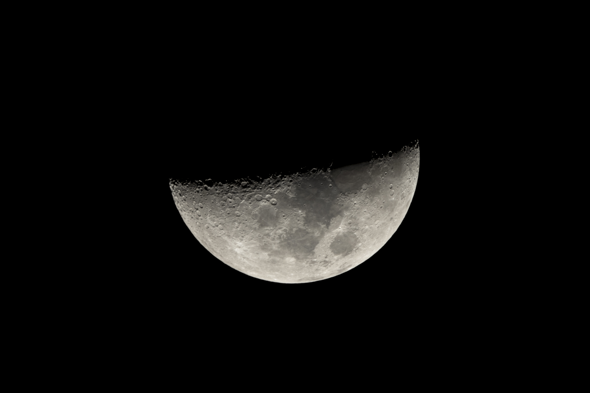

## February – Snow Moon

A few days after taking the photo above, it was time for February's Snow Moon.

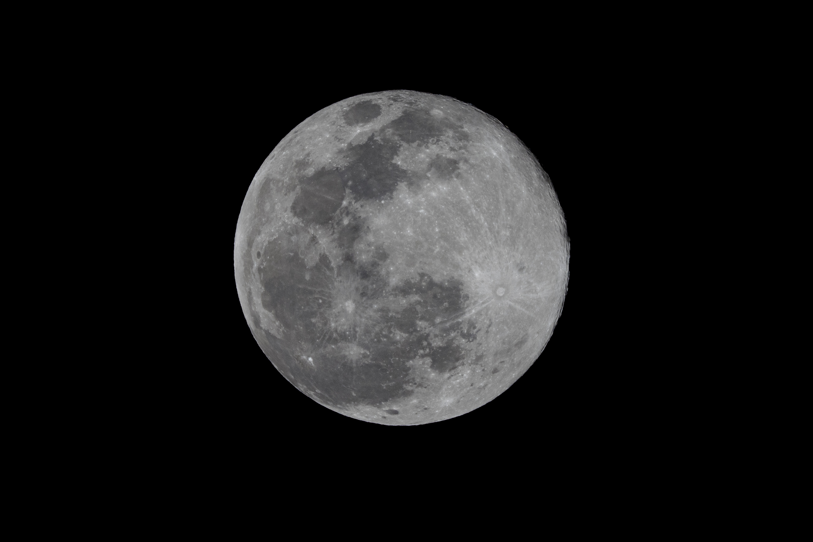

## March – Worm Moon

My plans to photograph every full moon hit a snag in March due to bad weather. This taught me an important lesson: "always have a backup plan". So starting in April, **if there was rain in the forecast, I would take a photo each night leading up full moon.** Backup photos saved me a few times the remainder of the year!

Instead of March's Worm Moon, here is my gear!

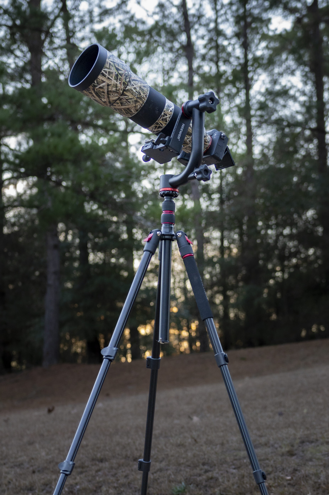

My camera setup for photographing the moon: 62&#8243; Mactrem tripod, Neewer gimbal, Sony a7R4, and Sony FE 200-600mm G OSS.

## April – Pink Moon

The skies cleared up in April for the Pink Moon:

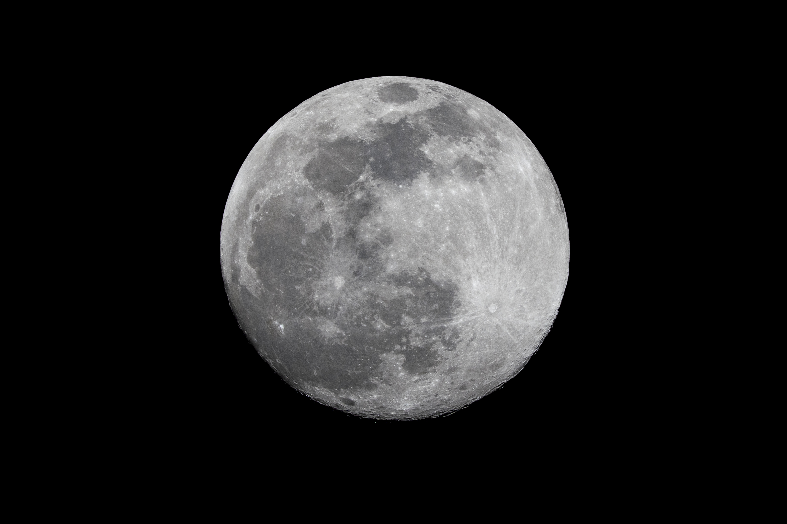

## May – Flower Moon

I almost didn't get this photo of May's Flower Moon thanks to all the rain (I did have a backup) but I was determined to get a shot at 100%. Around 10 pm the clouds broke up _just enough_ for me to snap this!

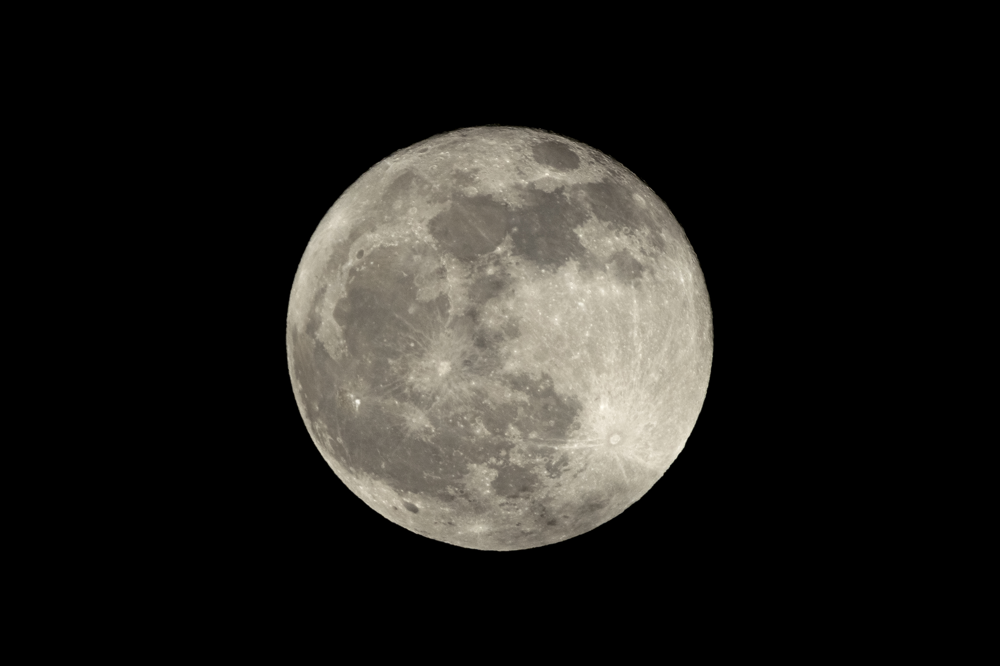

## June – Strawberry Moon

**Summer brought its own hurdles with oppressive humid air**, often leaving the moon with a surrounding glow and a soft-focus effect. I overcame this in Lightroom using masks, along with increasing texture, clarity, and dehaze adjustments. As an aside, The Strawberry Moon will always hold a special place in my heart after last year's adventure capturing the [Strawberry Supermoon](https://gregrickaby.com/behind-the-shot-nearly-strawberry-supermoon/).

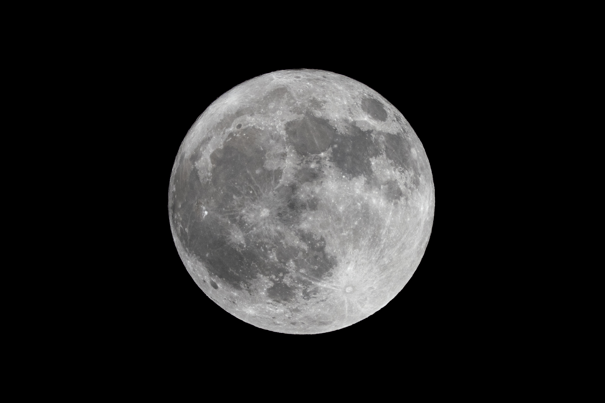

## July – Buck Supermoon

July brought the first supermoon of 2023 and kicked off a string of 4 super moons in a row. A "supermoon" is always closer to Earth, so in theory it should be slightly larger and brighter (depending on when you view it).

By now, my excitement over astrophotography has reached its fever pitch, and I purchased a [Viltrox 16mm f/1.8](https://amzn.to/3RTqzqD) so I could learn how to take Milky Way photos.

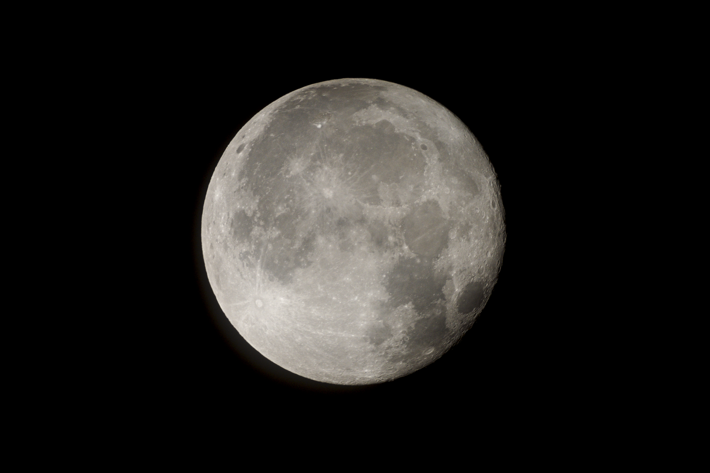

## August – Sturgeon Supermoon

The Sturgeon Moon was the next super moon and the first of two supermoons in August. It was going to be a great month!

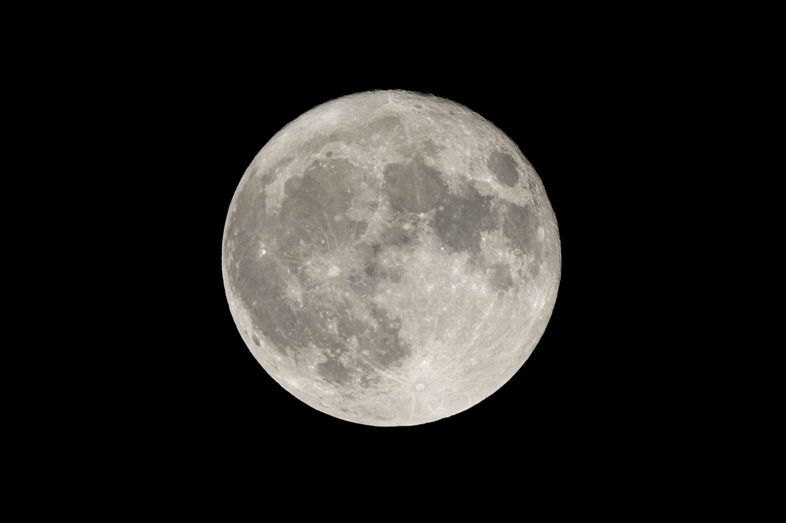

## August – Super Blue Moon

August's Super Blue Moon was the highlight of the year. This rare phenomenon won't happen again until August 2032, making it a memorable night. **I was also able to hang out with friends while shooting which added to its significance.**

Additionally, I was also regularly shooting the [Milky Way](/blog/milky-way-on-august-9).

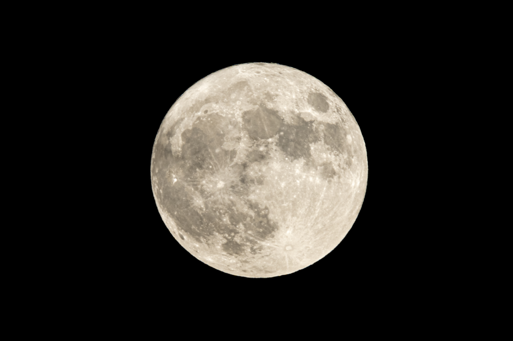

## September – Harvest Supermoon

The final Supermoon of the 2023 was the Harvest Supermoon in September.

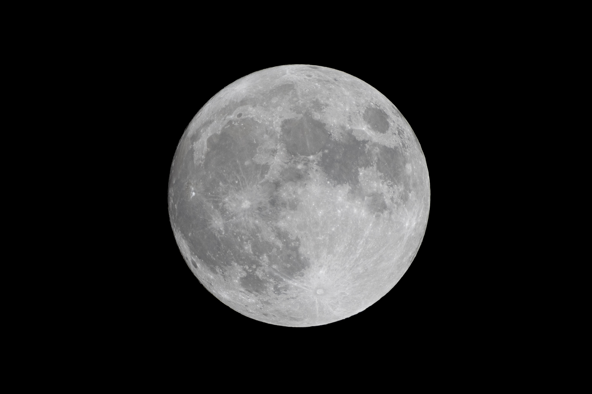

## October – Hunter's Moon

I was traveling to [Duck Camp 2023](https://gregrickaby.com/blog/duck-camp-2023/) during the October's full moon, so this a "backup shot" of during the Waxing Gibbous. **While August's Super Blue Moon was the highlight of the year, this is my favorite photo.**

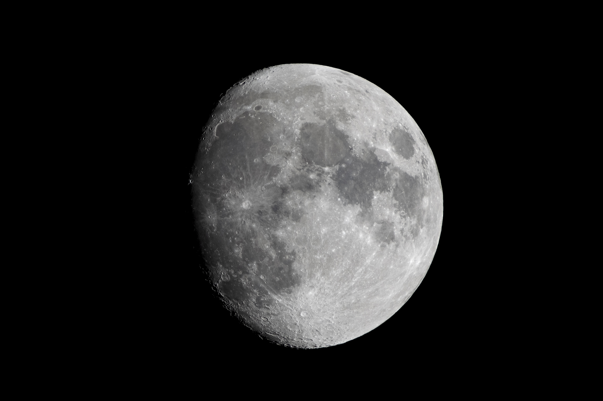

## November – Beaver Moon

Due to weather, this is another backup shot of November's Beaver Moon taken the day before at 99%. **I have to admit, by November, I was tired of taking moon photos. They all look the same!**

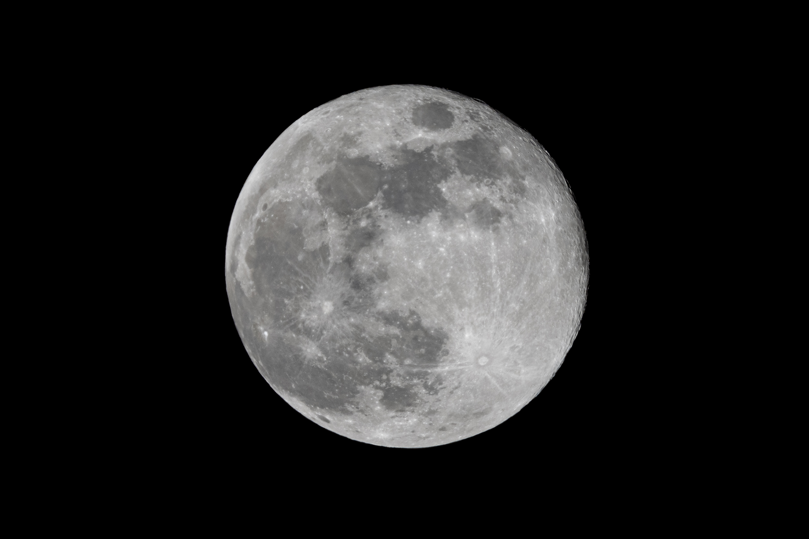

## December – Cold Moon

It was humid, raining, and windy (for days) when I took this. I sat under my carport waiting for a break in the clouds so I finally take the last moon photo of the year. My patience was thin because this entire challenge had worn out its welcome, but my quick trigger finger paid off; when clouds broke for a few seconds and I snapped a hazy-out-of-focus December Cold Moon, which is arguably my worst moon photo of the year. 🤣

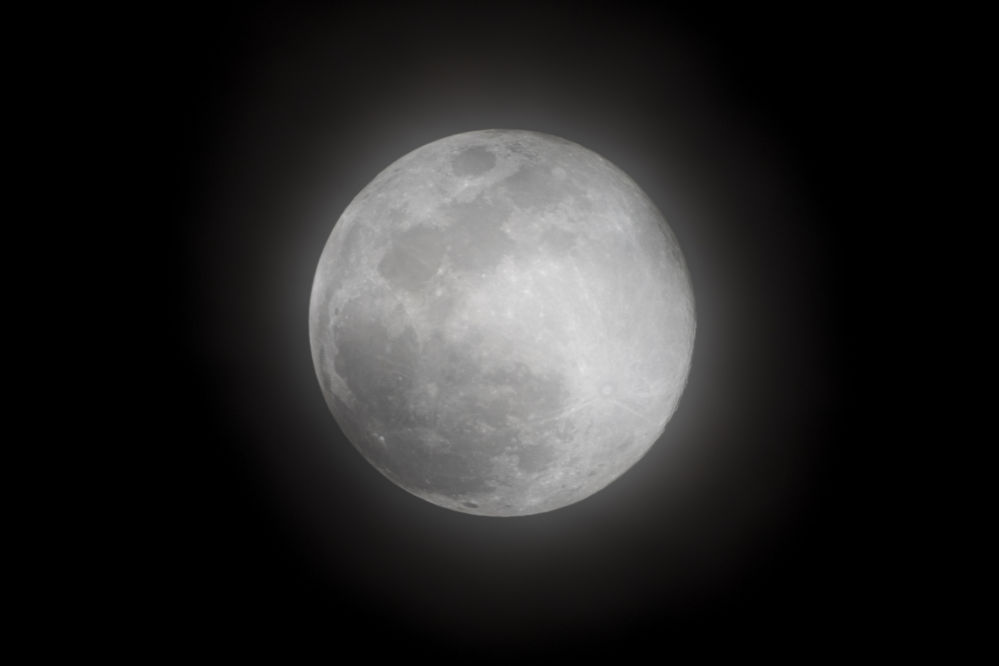

## Wrap Up

Would I ever do something like this again? Nope! 🤣 Instead, I'll wait for special celestial events and try to compose a shot with something in the foreground– which makes for a much more interesting photo.

Still, this year was filled with technical adjustments, environmental challenges, and rare celestial events, and was more than just about "learning something new". It was a lesson in persistence, patience, and adaptability.

Thanks for reading!
